# Arquitectura — kgwy_javalib_orchestrator

> Versión documentada: `orchestratorlib 2.16.0` sobre `arqGw 2.13.0`
> Última actualización: 2026-02-28

---

## Tabla de contenidos

1. [Visión general](#1-visión-general)
2. [Arquitectura interna](#2-arquitectura-interna)
3. [Flujo completo de una solicitud](#3-flujo-completo-de-una-solicitud)
4. [Arquitectura del motor de reglas](#4-arquitectura-del-motor-de-reglas)
5. [Arquitectura de configuración](#5-arquitectura-de-configuración)
6. [Arquitectura de manejo de errores](#6-arquitectura-de-manejo-de-errores)
7. [Decisiones de arquitectura (ADRs)](#7-decisiones-de-arquitectura-adrs)
8. [Guía para consumidores](#8-guía-para-consumidores)
9. [Evolución del componente](#9-evolución-del-componente)

---

## 1. Visión general

### Rol de kgwy_javalib_orchestrator en el ecosistema

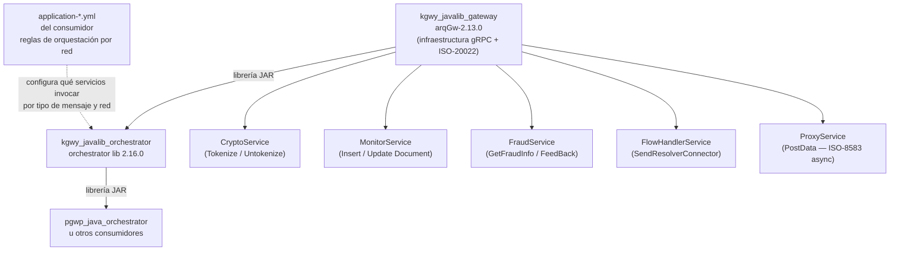

### Qué hace kgwy_javalib_orchestrator

`kgwy_javalib_orchestrator` es una **librería JAR compartida** que provee el motor de orquestación para los microservicios del gateway financiero BBVA. Recibe mensajes ISO-8583 crudos vía gRPC, los convierte al modelo canónico ISO-20022 (usando `IParser` del consumidor), aplica validaciones de negocio configuradas en YAML, evalúa reglas BRMS para determinar qué microservicios invocar, ejecuta la cadena dinámica resultante y devuelve la respuesta serializada de vuelta a ISO-8583.

### Qué NO hace kgwy_javalib_orchestrator

- **No implementa servicios de negocio**: no tokeniza, no detecta fraude, no registra transacciones — solo orquesta quién lo hace.
- **No define el modelo ISO-20022**: lo hereda íntegramente de `arqGw`.
- **No implementa la lógica de parseo ISO-8583**: la delega a `IParser`, implementada por el consumidor.
- **No es un microservicio ejecutable**: es una librería JAR. El consumidor (`pgwp_java_orchestrator` u otro) es quien se despliega.
- **No gestiona persistencia ni estado entre transacciones**: cada invocación gRPC es independiente.
- **No define reglas de negocio**: las reglas viven en el `application-*.yml` del consumidor, no en el código Java de kgwy.

### Característica distintiva

`kgwy_javalib_orchestrator` **no tiene una cadena fija de servicios**. La cadena se construye dinámicamente en runtime evaluando las reglas YAML que el consumidor provee en su `application-*.yml`. El mismo kgwy puede comportarse diferente para PEER01 vs PEER02, para un `0100` vs un `0800`, o para un ambiente `local` vs `data` — sin modificar una línea de código Java.

---

## 2. Arquitectura interna

### Tipo de arquitectura

**Capas verticales con Command pattern.** No es hexagonal — no hay puertos/adaptadores propios explícitos. El flujo es estrictamente descendente. La única abstracción de extensión para el consumidor son las interfaces `IParser`, `IGrpcControlDialogoClient`, `IGrpcDummyClient`, `IValidationsLocal` e `IValidationsLocalErr`.

### Diagrama de paquetes

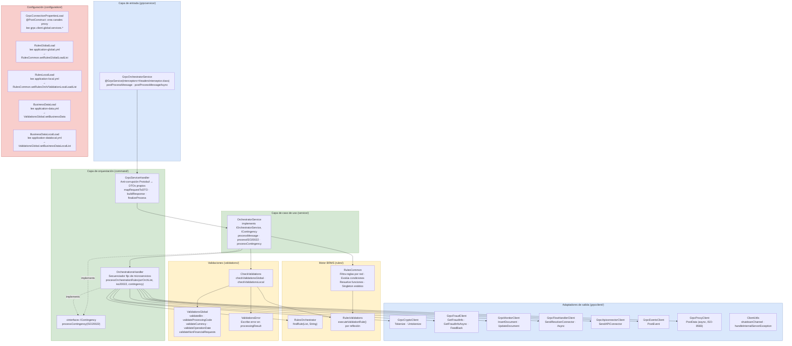

### Responsabilidades por capa

| Capa | Clases | Responsabilidad |
|---|---|---|
| **Entrada gRPC** | `GrpcOrchestratorService` | Recibir mensajes Protobuf; gestionar try/catch/finally; garantizar que `responseObserver` siempre se complete |
| **Command** | `GrpcServiceHandler`, `OrchestrationsHandler` | Traducir entre Protobuf y dominio; secuenciar las llamadas a microservicios en orden fijo |
| **Caso de uso** | `OrchestratorService` | Coordinar parseo, validaciones BRMS y orquestación; manejar contingencia |
| **Motor BRMS** | `RulesCommon`, `RulesOrchestrator`, `RulesValidations` | Cargar reglas YAML; evaluar condiciones sobre el ISO-20022 por reflexión; determinar qué funciones ejecutar |
| **Validaciones** | `CheckValidations`, `ValidationsGlobal`, `ValidationsError` | Validar datos de negocio (BIN, moneda, fecha, códigos) antes de orquestar |
| **Clientes gRPC** | `Grpc*Client`, `GrpcProxyClient`, `ClientUtils` | Invocar los microservicios externos; gestionar canales reutilizables; absorber errores en traceData |
| **Configuración** | `*Load` | Cargar YAMLs en `@PostConstruct` e inicializar singletons estáticos de `RulesCommon` y `ValidationsGlobal` |

---

## 3. Flujo completo de una solicitud

### 3.1 Flujo síncrono (postProcessMessage)

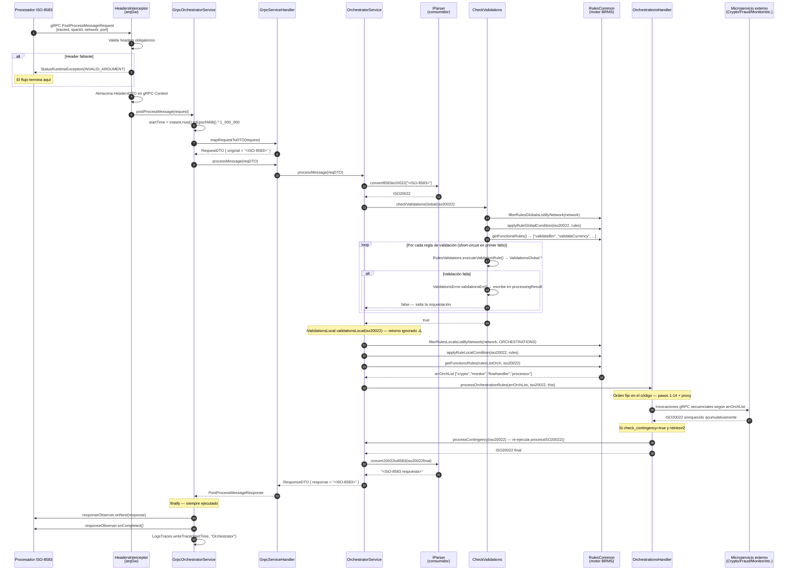

### 3.2 Flujo asíncrono (postProcessMessageAsync)

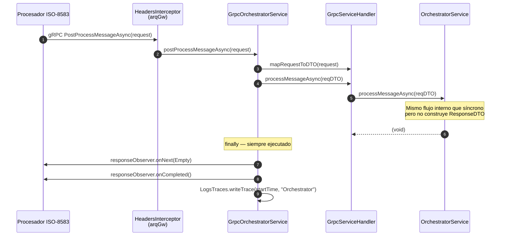

### 3.3 Descripción paso a paso del flujo síncrono

| Paso | Ejecutor | Decisión / Acción | Output |
|---|---|---|---|
| 1 | `HeadersInterceptor` (arqGw) | Valida que los 4 headers obligatorios estén presentes | Si faltan → `StatusRuntimeException(INVALID_ARGUMENT)` inmediato |
| 2 | `GrpcOrchestratorService` | Registra `startTime` y envuelve todo en try/catch/finally | Garantiza que `responseObserver` siempre recibe respuesta |
| 3 | `GrpcServiceHandler` | Extrae `originalMessage` del Protobuf → `RequestDTO` | Anti-corrupción entre Protobuf y dominio propio |
| 4 | `IParser` (consumidor) | Parsea el string ISO-8583 crudo al modelo ISO-20022 | Objeto `ISO20022` hidratado con la transacción |
| 5 | `CheckValidations` + `RulesCommon` | Evalúa reglas globales BRMS (BIN, moneda, fecha, etc.) | Si alguna falla: escribe en `processingResult` y salta la orquestación |
| 6 | `IValidationsLocal` (consumidor) | Ejecuta validaciones de negocio locales del consumidor | ⚠️ El retorno es ignorado en `OrchestratorService` |
| 7 | `RulesCommon` | Filtra y evalúa reglas locales de orquestación por red | `arrOrchList`: lista de funciones a ejecutar (e.g., `["crypto","monitor","host"]`) |
| 8 | `OrchestrationsHandler` | Ejecuta los pasos de la cadena en orden fijo según `arrOrchList` | `ISO20022` enriquecido acumulativamente tras cada servicio |
| 9 | `IParser` (consumidor) | Serializa el `ISO20022` final de vuelta a ISO-8583 | String con el mensaje de respuesta |
| 10 | `GrpcOrchestratorService` | Empaqueta la respuesta en Protobuf y la envía al caller | `PostProcessMessageResponse` + `LogsTraces.writeTrace` |

---

## 4. Arquitectura del motor de reglas

Esta sección es exclusiva de `kgwy_javalib_orchestrator`. Ningún otro componente del ecosistema tiene un motor de reglas dinámico de este tipo. El motor tiene tres fases: **carga**, **evaluación** y **construcción de cadena**.

### 4.1 Carga de reglas al iniciar (Spring Boot startup)

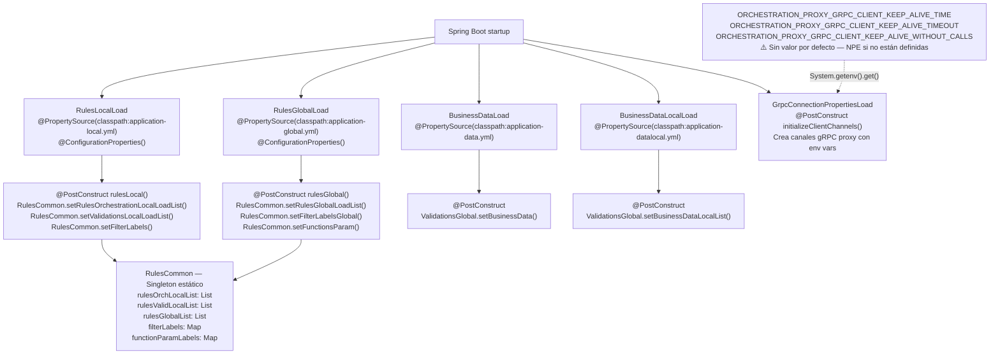

### 4.2 Evaluación de reglas en runtime

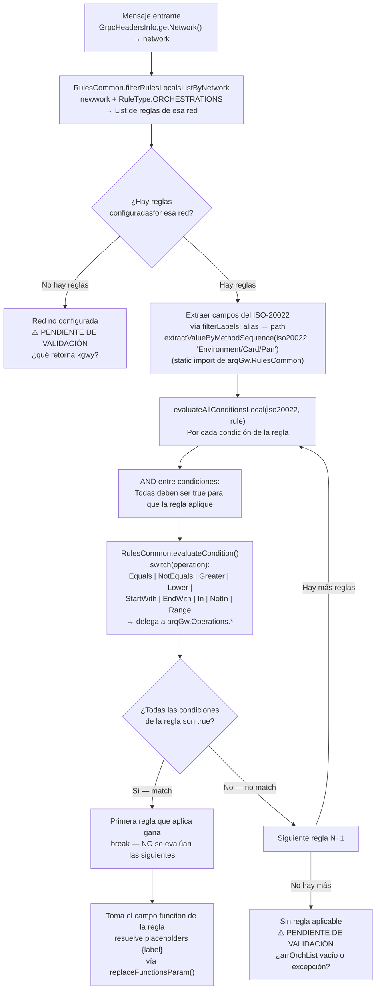

### 4.3 Construcción de la cadena desde el campo `function`

```mermaid
graph LR
    functionStr["function: 'crypto,monitor,flowhandler,processor'"]
    split["split por coma\nregex: ,\\s*(?![^()]*\\))\nPreserva comas dentro de paréntesis"]
    resolve["{label} → replaceFunctionsParam()\nfunctionParamLabels: alias → path ISO-20022\nextractValueByMethodSequence(iso20022, path)"]
    arrOrchList["arrOrchList: List&lt;String&gt;\n['crypto','monitor','flowhandler','processor']"]
    handler["OrchestrationsHandler.processOrchestrationRules(arrOrchList)\narrOrchList.contains(NAME) por cada paso fijo"]
    chain["Cadena efectiva ejecutada:\nGrpcCryptoClient → GrpcMonitorClient\n→ GrpcFlowHandlerClient → GrpcProxyClient"]

    functionStr --> split
    split --> resolve
    resolve --> arrOrchList
    arrOrchList --> handler
    handler --> chain
```

**Importante**: `arrOrchList` es una **lista de presencia** — indica qué pasos ejecutar, no el orden. El orden real está hardcodeado en `OrchestrationsHandler.processOrchestrationRules()`. Si el YAML pone `"host,monitor"`, monitor siempre se ejecuta antes que host en el código.

### 4.4 Tabla completa de funciones disponibles

| Función en YML | Clase en kgwy | Microservicio en arqGw | Propósito |
|---|---|---|---|
| `crypto` | `GrpcCryptoClient` | `CryptoService` | Tokeniza datos sensibles de la tarjeta (pos 1 — siempre primero) |
| `monitor` | `GrpcMonitorClient` | `MonitorService` | Registra estado inicial de la transacción (pos 2 — siempre segundo) |
| `fraud` | `GrpcFraudClient` | `FraudService.GetFraudInfo` | Consulta prevención de fraude (bloqueante) |
| `fraudasync` | `GrpcFraudClient` | `FraudService.GetFraudInfoAsync` | Consulta fraude asíncrona en FraudService; **bloqueante** en kgwy ⚠️ |
| `dialog` | `IGrpcControlDialogoClient` | (impl. del consumidor) | Diálogo específico del consumidor |
| `dialogcontrol` | `GrpcDialogControlClient` (arqGw) | `DialogControlService.Process` | Control de diálogo estándar de la plataforma |
| `apiconnector` | `GrpcApiconnectorClient` | `ApiConnectorService.SendAPIConnector` | Conexión a API externa vía conector |
| `dummyprocessor` | `IGrpcDummyClient` | (impl. del consumidor) | Procesador de prueba del consumidor |
| `events` | `GrpcEventsClient` | `EventService.PostEvent` | Publica eventos de la transacción |
| `flowhandler` | `GrpcFlowHandlerClient` | `FlowHandlerService.SendResolverConnector` | Envía transacción al manejador de flujo; activa `isNextGen=true` |
| `flowhandlerasync` | `GrpcFlowHandlerClient` | `FlowHandlerService.SendResolverConnectorAsync` | Envía asíncronamente al manejador de flujo; activa `isNextGen=true` |
| `feedbackfraud` | `GrpcFraudClient` | `FraudService.PostFeedBackFraud` | Retroalimentación del resultado al sistema antifraude |
| `uncrypto` | `GrpcCryptoClient` | `CryptoService.Untokenize` | Destokeniza datos de la tarjeta |
| `updatemonitor` | `GrpcMonitorClient` | `MonitorService.PostPatchUpdateDocument` | Actualiza el registro de la transacción con el resultado |
| `processor` | `GrpcProxyClient` | `ProxyService.PostData` | Envía ISO-8583 async (fire-and-forget) al procesador legacy; activa `isNextGen=false` |
| `host` | `GrpcProxyClient` | `ProxyService.PostData` | Envía ISO-8583 async (fire-and-forget) al host legacy; activa `isNextGen=false` |

### 4.5 Diagrama de flujo de la cadena de orquestación

```mermaid
flowchart TD
    START(["processOrchestrationRules\narrOrchList, iso20022"]) --> CRYPTO_CHECK{"¿'crypto'\nen lista?"}

    CRYPTO_CHECK -->|Sí| CRYPTO["GrpcCryptoClient\nCryptoService.Tokenize\nBlocking"]
    CRYPTO_CHECK -->|No| MONITOR_CHECK

    CRYPTO --> CRYPTO_ERR{"¿check_crypto=true\nen traceData?"}
    CRYPTO_ERR -->|"Sí — falló Crypto"| MONITOR_CHECK2

    CRYPTO_ERR -->|"No — Crypto OK"| MONITOR_CHECK
    MONITOR_CHECK{"¿'monitor'\nen lista?"} -->|Sí| MONITOR["GrpcMonitorClient\nMonitorService.PostPatchInsertDocument\nBlocking"]
    MONITOR_CHECK -->|No| CONTINGENCY_GATE
    MONITOR --> CONTINGENCY_GATE

    MONITOR_CHECK2{"¿'monitor'\nen lista?"} -->|Sí| MONITOR2["GrpcMonitorClient\nMonitorService.PostPatchInsertDocument\nBlocking"]
    MONITOR_CHECK2 -->|No| PROXY_GATE
    MONITOR2 --> PROXY_GATE

    CONTINGENCY_GATE{"¿check_crypto=true?"} -->|"Sí → salta pasos 3-14"| PROXY_GATE
    CONTINGENCY_GATE -->|Normal| FRAUD_CHECK

    FRAUD_CHECK{"¿'fraud'?"} -->|Sí| FRAUD["GrpcFraudClient\nFraudService.GetFraudInfo"]
    FRAUD_CHECK -->|No| FRAUDASYNC_CHECK
    FRAUD --> FRAUDASYNC_CHECK

    FRAUDASYNC_CHECK{"¿'fraudasync'?"} -->|Sí| FRAUDASYNC["GrpcFraudClient\nFraudService.GetFraudInfoAsync\nBlocking stub ⚠️"]
    FRAUDASYNC_CHECK -->|No| DIALOG_CHECK
    FRAUDASYNC --> DIALOG_CHECK

    DIALOG_CHECK{"¿'dialog'?"} -->|Sí| DIALOG["IGrpcControlDialogoClient\nimpl. del consumidor"]
    DIALOG_CHECK -->|No| DIALOGCTRL_CHECK
    DIALOG --> DIALOGCTRL_CHECK

    DIALOGCTRL_CHECK{"¿'dialogcontrol'?"} -->|Sí| DIALOGCTRL["GrpcDialogControlClient (arqGw)\nDialogControlService.Process"]
    DIALOGCTRL_CHECK -->|No| APICONN_CHECK
    DIALOGCTRL --> APICONN_CHECK

    APICONN_CHECK{"¿'apiconnector'?"} -->|Sí| APICONN["GrpcApiconnectorClient\nApiConnectorService.SendAPIConnector"]
    APICONN_CHECK -->|No| DUMMY_CHECK
    APICONN --> DUMMY_CHECK

    DUMMY_CHECK{"¿'dummyprocessor'?"} -->|Sí| DUMMY["IGrpcDummyClient\nimpl. del consumidor"]
    DUMMY_CHECK -->|No| EVENTS_CHECK
    DUMMY --> EVENTS_CHECK

    EVENTS_CHECK{"¿'events'?"} -->|Sí| EVENTS["GrpcEventsClient\nEventService.PostEvent\nSi falla: check_beaEvent=false"]
    EVENTS_CHECK -->|No| FLOW_CHECK
    EVENTS --> FLOW_CHECK

    FLOW_CHECK{"¿'flowhandler'?"} -->|Sí| FLOW["GrpcFlowHandlerClient\nFlowHandlerService.SendResolverConnector\nisNextGen=true"]
    FLOW_CHECK -->|No| FLOWASYNC_CHECK
    FLOW --> FLOWASYNC_CHECK

    FLOWASYNC_CHECK{"¿'flowhandlerasync'?"} -->|Sí| FLOWASYNC["GrpcFlowHandlerClient\nFlowHandlerService.SendResolverConnectorAsync\nisNextGen=true"]
    FLOWASYNC_CHECK -->|No| FEEDBACKFRAUD_CHECK
    FLOWASYNC --> FEEDBACKFRAUD_CHECK

    FEEDBACKFRAUD_CHECK{"¿'feedbackfraud'?"} -->|Sí| FEEDBACKFRAUD["GrpcFraudClient\nFraudService.PostFeedBackFraud"]
    FEEDBACKFRAUD_CHECK -->|No| UNCRYPTO_CHECK
    FEEDBACKFRAUD --> UNCRYPTO_CHECK

    UNCRYPTO_CHECK{"¿'uncrypto'?"} -->|Sí| UNCRYPTO["GrpcCryptoClient\nCryptoService.Untokenize"]
    UNCRYPTO_CHECK -->|No| UPDATEMONITOR_CHECK
    UNCRYPTO --> UPDATEMONITOR_CHECK

    UPDATEMONITOR_CHECK{"¿'updatemonitor'?"} -->|Sí| UPDATEMONITOR["GrpcMonitorClient\nMonitorService.PostPatchUpdateDocument"]
    UPDATEMONITOR_CHECK -->|No| CONTINGENCY_CHECK
    UPDATEMONITOR --> CONTINGENCY_CHECK

    CONTINGENCY_CHECK{"¿check_contingency=true\ny retries≠2?"} -->|Sí| REPROCESS["OrchestratorService.processISO20022()\nRe-ejecuta COMPLETO desde parseo\nMarca check_contingency_retries=2"]
    REPROCESS --> PROXY_GATE
    CONTINGENCY_CHECK -->|No| PROXY_GATE

    PROXY_GATE{"¿'processor'\no 'host'?"} -->|Sí| PROXY_SEL["Selecciona ChannelGrpc\nchannelName.contains(network)\n&& channelName.contains(port)"]
    PROXY_GATE -->|No| END
    PROXY_SEL --> PROXY["GrpcProxyClient\nProxyService.PostData\nAsync — fire-and-forget\nEnvía ISO-8583 serializado"]
    PROXY --> END(["ISO20022 final"])
```

---

## 5. Arquitectura de configuración

### Modelo de configuración

`kgwy_javalib_orchestrator` **no tiene sus propios archivos de reglas**. Spring Boot los carga desde el classpath del proyecto consumidor por convención de nombres de perfil.

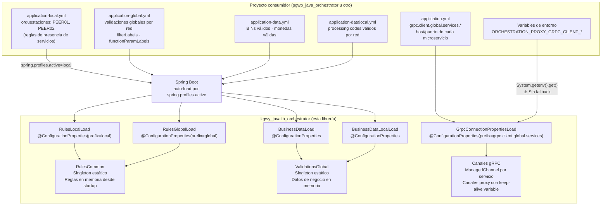

### Zonas de configuración

| Zona | Prefijo YAML | Responsable | Referencia |
|---|---|---|---|
| Orquestaciones por red | `local.orchestrations` | Consumidor | `docs/orchestration-rules-contract.md` |
| Validaciones locales | `local.validations` | Consumidor | `docs/orchestration-rules-contract.md` |
| Filtros de campos (alias → ruta) | `local.filterLabels` | Consumidor | `docs/orchestration-rules-contract.md` |
| Validaciones globales | `global.validations` | Consumidor | `docs/orchestration-rules-contract.md` |
| Filtros globales | `global.filterLabels` | Consumidor | `docs/orchestration-rules-contract.md` |
| Parámetros dinámicos de funciones | `global.functionParamLabels` | Consumidor | Solo en reglas globales |
| Datos de negocio (BINs, monedas) | (raíz) | Consumidor | `application-data.yml` |
| Datos de negocio locales | (raíz) | Consumidor | `application-datalocal.yml` |
| Conexiones a microservicios | `grpc.client.global.services.*` | Consumidor | `dependencies/kgwy_javalib_gateway/CONTRACT.md` |
| Keep-alive de canales proxy | Variables de entorno | Ops/Infra | ⚠️ Sin valor por defecto |

### Variables de entorno obligatorias

| Variable | Descripción | ⚠️ Riesgo |
|---|---|---|
| `ORCHESTRATION_PROXY_GRPC_CLIENT_KEEP_ALIVE_TIME` | Tiempo de keep-alive (segundos) para canales proxy | `NullPointerException` en startup si no está definida |
| `ORCHESTRATION_PROXY_GRPC_CLIENT_KEEP_ALIVE_TIMEOUT` | Timeout de keep-alive (segundos) para canales proxy | `NullPointerException` en startup si no está definida |
| `ORCHESTRATION_PROXY_GRPC_CLIENT_KEEP_ALIVE_WITHOUT_CALLS` | `true`/`false` — mantener keep-alive sin llamadas activas | `NullPointerException` / `NumberFormatException` en startup si no está definida |

### Selección del canal proxy en runtime

El canal proxy se selecciona comparando el nombre del `ChannelGrpc` (derivado de `channelServer` en el YAML) contra los headers gRPC `network` y `port` actuales:

```java
// OrchestrationsHandler.processProxyRule()
String network = GrpcHeadersInfo.getNetwork().toLowerCase();
String port    = GrpcHeadersInfo.getPort();
String clusterPort = GrpcHeadersInfo.getClusterPort();
if (clusterPort != null && !clusterPort.isEmpty()) port = clusterPort;

// El channelServer del YAML debe contener tanto el network como el port en su nombre
if (channelName.contains(network) && channelName.contains(port)) { /* usa este canal */ }
```

**Consecuencia**: el valor de `channelServer` para proxies en el `application.yml` del consumidor **debe incluir el identificador de red y el puerto** como subcadenas (e.g., `"peer01_9090_host"`).

---

## 6. Arquitectura de manejo de errores

### Jerarquía de errores

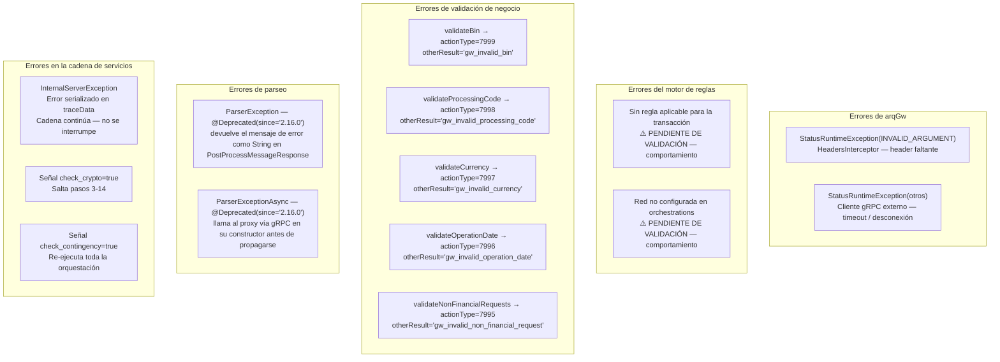

### Estrategia de propagación en la cadena

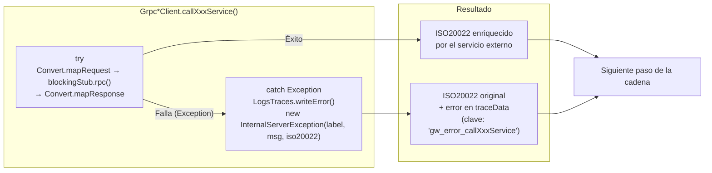

**Regla fundamental**: la cadena **nunca se detiene** por un error de un cliente gRPC. El siguiente paso recibe el `ISO20022` con el error en `traceData` y continúa.

### Comportamientos especiales al fallar

| Cliente | Al fallar escribe en traceData | Efecto en la cadena |
|---|---|---|
| `GrpcCryptoClient.callCryptoTokenService` | `check_crypto=true` + `gw_error_callCryptoService` | **Salta los pasos 3-14** (cortocircuito de seguridad) |
| `GrpcEventsClient.callPostEventsService` | `check_beaEvent=false` + `gw_error_callEventsService` | Cadena continúa; el downstream puede leer `check_beaEvent` |
| Todos los demás | `gw_error_callXxxService` | Cadena continúa sin cortocircuito |

### Bug conocido: log incorrecto en StatusRuntimeException

```java
// GrpcOrchestratorService — catch (StatusRuntimeException se)
LogsTraces.writeError(LOG_PREFIX + "DEADLINE EXCEEDED: " + se.getMessage());
```

Este catch captura tanto `DEADLINE_EXCEEDED` como `INVALID_ARGUMENT` (lanzado por `HeadersInterceptor` cuando falta un header). El mensaje de log `"DEADLINE EXCEEDED"` es **incorrecto** para el caso de header faltante. ⚠️ PENDIENTE DE CORRECCIÓN.

### Diagrama de flujo de errores de validación

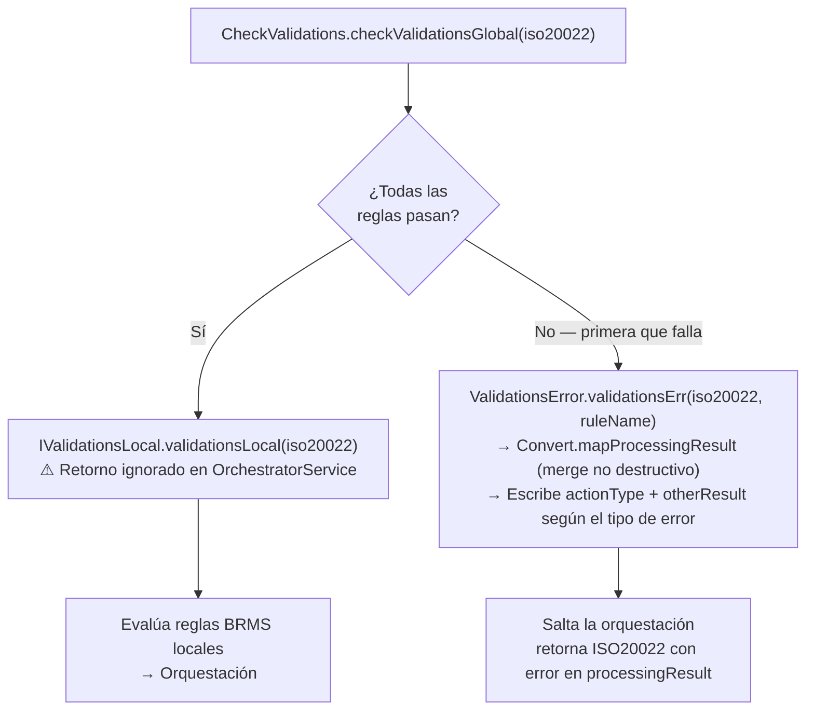

---

## 7. Decisiones de arquitectura (ADRs)

---

**ADR-001 — ISO-20022 como modelo canónico compartido con arqGw**

- **Contexto**: El orquestador procesa mensajes ISO-8583 pero todos los microservicios del gateway hablan ISO-20022 (Protobuf). Se necesita un modelo interno común.
- **Decisión**: Adoptar el modelo ISO-20022 de `arqGw` (`ISO20022` DTO + `Iso20022Request/Response` Protobuf) como modelo canónico. El parseo ISO-8583 ↔ ISO-20022 se delega a `IParser`, implementada por el consumidor.
- **Consecuencias**: ✅ Un único modelo fluye por toda la cadena, acumulando datos entre servicios. ✅ Los clientes gRPC se uniformizan: todos hacen `Convert.mapRequest → stub.rpc() → Convert.mapResponse`. ⚠️ El modelo ISO-20022 de arqGw (~100 DTOs) es la única interfaz entre el orquestador y los microservicios — cualquier cambio en el proto requiere recompilar todo.
- **Estado**: Activo

---

**ADR-002 — Orden de orquestación fijo en código; presencia de pasos controlada por YAML**

- **Contexto**: La secuencia de microservicios varía según el tipo de transacción y la red, pero hay restricciones de negocio sobre qué debe ejecutarse antes que qué (Crypto antes que Fraud, Monitor antes que el proxy).
- **Decisión**: El **orden** de evaluación de los pasos (`crypto → monitor → fraud → … → proxy`) está hardcodeado en `OrchestrationsHandler.processOrchestrationRules()`. La **presencia** de cada paso en una transacción concreta está controlada por el campo `function` del YAML vía `arrOrchList`.
- **Consecuencias**: ✅ No se puede violar el orden por configuración errónea. ✅ Agregar un servicio nuevo requiere modificar un único lugar en el código. ⚠️ `arrOrchList` es una lista de presencia, no de orden — el consumidor no puede cambiar el orden solo con YAML. ⚠️ Cambiar el orden de dos servicios existentes requiere un deploy.
- **Estado**: Activo

---

**ADR-003 — El ISO-20022 es mutable y acumulativo entre servicios**

- **Contexto**: Cada servicio en la cadena puede necesitar datos producidos por el servicio anterior (Fraud necesita los tokens de Crypto; FlowHandler necesita los datos de Fraud).
- **Decisión**: El mismo objeto `ISO20022` se pasa de servicio en servicio. Cada cliente gRPC recibe el estado actual, llama al servicio externo (que lo enriquece) y retorna el estado modificado. No hay copia ni aislamiento entre pasos.
- **Consecuencias**: ✅ Los datos fluyen naturalmente entre servicios sin estructuras intermedias. ✅ Un servicio puede escribir señales de control en `traceData` que los pasos posteriores leen. ⚠️ Un servicio que corrompe el ISO-20022 afecta a todos los siguientes. ⚠️ No hay rollback: si un servicio falla a medias, el estado queda parcialmente modificado.
- **Estado**: Activo

---

**ADR-004 — Errores serializados en traceData; nunca como excepciones gRPC**

- **Contexto**: En gRPC los errores se modelan como `StatusRuntimeException`. Sin embargo, los microservicios aguas arriba necesitan la respuesta completa (con contexto de la transacción) aunque haya habido un error en algún paso de la cadena.
- **Decisión**: `InternalServerException` serializa el error en `traceData` del `ISO20022`. El servicio gRPC siempre llama `responseObserver.onNext() + onCompleted()` en el `finally`, nunca `onError()`. La excepción es `HeadersInterceptor`, que sí lanza `StatusRuntimeException` porque no hay `ISO20022` disponible aún.
- **Consecuencias**: ✅ El procesador siempre recibe una respuesta parseable. ✅ La cadena continúa aunque un servicio falle. ⚠️ El procesador debe inspeccionar `traceData` para detectar errores, no el código de estado gRPC.
- **Estado**: Activo

---

**ADR-005 — Señales de control en traceData para cortocircuitar la cadena**

- **Contexto**: Cuando `CryptoService` falla, ejecutar `FraudService` o `ApiConnectorService` con datos no tokenizados podría ser inseguro.
- **Decisión**: `GrpcCryptoClient.callCryptoTokenService` escribe `check_crypto=true` en `traceData` al fallar. `OrchestrationsHandler.checkCryptoIsPresent()` lee esta clave antes de los pasos 3-14 y los salta si está presente. Mismo patrón: `GrpcEventsClient` escribe `check_beaEvent=false`.
- **Consecuencias**: ✅ La cadena se adapta dinámicamente al estado del ISO-20022 sin estructuras de control adicionales. ⚠️ Acoplamiento implícito: `GrpcCryptoClient` y `OrchestrationsHandler` comparten la clave `"check_crypto"` como contrato informal no documentado fuera del código.
- **Estado**: Activo

---

**ADR-006 — Canales gRPC salientes reutilizables con AtomicReference**

- **Contexto**: Los microservicios se llaman en cada transacción. Crear y destruir un canal gRPC por llamada tiene un coste de negociación TCP/TLS inaceptable en producción.
- **Decisión**: Cada `Grpc*Client` mantiene un `AtomicReference<ManagedChannel>` con el canal activo. El canal se crea en `@PostConstruct` y se reutiliza. `AtomicReference.compareAndSet` evita condiciones de carrera al reconectar. Keep-alive fijo: 1200 s de tiempo, 60 s de timeout. Los canales proxy son la excepción: parámetros configurables vía variables de entorno.
- **Consecuencias**: ✅ Mínima latencia por transacción — sin overhead de conexión. ✅ Seguridad ante concurrencia con `compareAndSet`. ⚠️ Los canales usan `usePlaintext()` — sin TLS. ⚠️ Bug conocido: `GrpcEventsClient` tiene `@PostConstruct` en `shutdown()` en lugar de `@PreDestroy` — el canal se destruye al arrancar.
- **Estado**: Activo (con bug pendiente en `GrpcEventsClient`)

---

**ADR-007 — Contingencia como re-ejecución completa con contador de reintentos en traceData**

- **Contexto**: Algunos microservicios pueden detectar condiciones de contingencia (red caída, estado inconsistente) y señalarlo para que el orquestador lo reintente.
- **Decisión**: Si `traceData` contiene `check_contingency=true` y `check_contingency_retries ≠ "2"`, `OrchestrationsHandler` invoca `IContingency.processContingency()`, que re-ejecuta `processISO20022()` completo. Antes de re-ejecutar se muta `check_contingency_retries` de `"1"` a `"2"` para bloquear un segundo reintento.
- **Consecuencias**: ✅ Un único reintento automático sin intervención del procesador. ✅ El contador está en el propio ISO-20022 — no necesita estado externo. ⚠️ Quién escribe `check_contingency=true` es un microservicio externo invisible en esta librería. ⚠️ Si el microservicio escribe `check_contingency=true` sin haber escrito `check_contingency_retries=1` antes, el mecanismo de bloqueo del segundo reintento no se activa.
- **Estado**: Activo

---

## 8. Guía para consumidores

### Lo mínimo que un consumidor necesita para usar kgwy_javalib_orchestrator

**1. Dependencia en pom.xml:**
```xml
<dependency>
    <groupId>com.bbva.orchlib</groupId>
    <artifactId>orchestratorlib</artifactId>
    <version>2.16.0</version>
</dependency>
```

**2. Implementar los 5 puertos requeridos como Spring beans:**

| Puerto | Paquete | Obligatorio | Notas |
|---|---|---|---|
| `IParser` | `com.bbva.orchlib.parser` | Sí | Lógica de parseo ISO-8583 ↔ ISO-20022 |
| `IGrpcControlDialogoClient` | `com.bbva.orchlib.grpcclient` | Sí | Cliente para el servicio de diálogo propio |
| `IGrpcDummyClient` | `com.bbva.orchlib.grpcclient` | Sí | Cliente para el procesador de prueba |
| `IValidationsLocal` | `com.bbva.orchlib.validations` | Sí ⚠️ | Validaciones locales — retorno ignorado actualmente |
| `IValidationsLocalErr` | `com.bbva.orchlib.validations` | Sí ⚠️ | Puerto inyectado en `CheckValidations` — **no documentado en CONTRACT.md** |

**3. Proveer los archivos de configuración:**

| Archivo | Contenido requerido |
|---|---|
| `application-local.yml` | `local.orchestrations` con reglas por red + `local.filterLabels` |
| `application-global.yml` | `global.validations` con reglas por red + `global.filterLabels` |
| `application-data.yml` | BINs y monedas válidos para `ValidationsGlobal` |
| `application-datalocal.yml` | Processing codes válidos por red |
| `application.yml` | `grpc.client.global.services.*` con host/puerto de cada microservicio |

**4. Definir las variables de entorno del proxy:**
```
ORCHESTRATION_PROXY_GRPC_CLIENT_KEEP_ALIVE_TIME=<segundos>
ORCHESTRATION_PROXY_GRPC_CLIENT_KEEP_ALIVE_TIMEOUT=<segundos>
ORCHESTRATION_PROXY_GRPC_CLIENT_KEEP_ALIVE_WITHOUT_CALLS=<true|false>
```

Ver estructura completa del YAML en `docs/orchestration-rules-contract.md`.

### Cómo agregar una nueva red

Las redes no están hardcodeadas en el código Java — solo en los YAMLs del consumidor:

1. Agregar un nuevo bloque en `application-local.yml`:
```yaml
local:
  orchestrations:
    - network: NUEVA_RED
      rules:
        - filter:
            - condition:
                - name: messageType
                  operation: In
                  value: "0100,0200"
          function: "crypto,monitor,host"
```

2. Si la nueva red requiere validaciones globales, agregar en `application-global.yml`:
```yaml
global:
  validations:
    - network: NUEVA_RED
      rules:
        - filter:
            - condition:
                - name: messageType
                  operation: In
                  value: "0100,0200"
          function: validateBin,validateCurrency
```

3. Asegurarse de que el header gRPC `network` que llega para mensajes de esa red coincide exactamente (case-insensitive en el código de selección de proxy) con el valor del campo `network` en el YAML.

**No se requiere ningún cambio en el código Java de kgwy.**

### Cómo agregar una nueva regla a una red existente

Agregar un elemento a la lista `rules` de la red correspondiente en `application-local.yml`:

```yaml
- network: PEER01
  rules:
    # Regla existente
    - filter:
        - condition:
            - name: messageType
              operation: In
              value: "0100,0120,0400"
      function: "crypto,monitor,host"
    # Nueva regla — se evalúa DESPUÉS de la anterior (short-circuit)
    - filter:
        - condition:
            - name: messageType
              operation: Equals
              value: "0800"
      function: "monitor,host"
```

**Importante**: las reglas se evalúan en orden y con short-circuit — la primera que aplica gana. El orden en el YAML determina la prioridad. No reordenar reglas sin análisis de impacto.

### Cómo agregar una función a la cadena

Esto **sí requiere modificar el código Java** de kgwy_javalib_orchestrator. Seis pasos:

1. Crear `GrpcNuevoServicioClient` en `com.bbva.orchlib.grpcclient/` siguiendo el patrón de `CLAUDE.md §7`.
2. Declarar el bean, el campo y la constante de nombre en `OrchestrationsHandler`.
3. Añadir `processNuevoServicioRuleIfPresent()` e invocarlo desde `processOrchestrationRules()` en la posición deseada.
4. Inicializar el canal en `@PostConstruct initializeClientChannels()`.
5. Añadir `ConnectionProperties nuevoServicio` en `GrpcConnectionPropertiesLoad`.
6. Configurar en el `application.yml` del consumidor y usar el nuevo nombre en los campos `function` del YAML de reglas.

Ver ejemplo completo en `CLAUDE.md §4`.

### Límites que el consumidor NO debe cruzar

- **No modificar el prefijo `local.*`** sin coordinar con el equipo de kgwy — es un breaking change para todos los consumidores.
- **No referenciar funciones que no estén en la tabla §4.4**: `OrchestrationsHandler` simplemente no las ejecutará (la clave no existirá en sus `contains()`), pero el comportamiento no generará error explícito. ⚠️ PENDIENTE DE VALIDACIÓN.
- **No asumir orden diferente al secuencial con short-circuit** al definir reglas: la primera regla que aplica siempre gana.
- **No usar `arrOrchList` para controlar el orden**: el orden está hardcodeado en `OrchestrationsHandler`. El YAML solo controla presencia, no secuencia.
- **No depender de `IValidationsLocal.validationsLocal()` para bloquear la orquestación**: el retorno es ignorado en `OrchestratorService` en la versión actual. ⚠️ BUG CONOCIDO.

---

## 9. Evolución del componente

### Cambios que NO requieren modificar código Java

Estos cambios son puramente de configuración — aplican en el siguiente arranque de la aplicación:

| Cambio | Cómo hacerlo |
|---|---|
| Agregar una nueva red | Nuevo bloque en `local.orchestrations` y/o `global.validations` |
| Agregar una regla a una red existente | Nuevo elemento en la lista `rules` de la red |
| Cambiar qué servicios se invocan para una transacción | Modificar el campo `function` de la regla correspondiente |
| Cambiar la condición de activación de una orquestación | Modificar `filter/condition` de la regla |
| Modificar los mensajes ISO 8583 que maneja una red | Cambiar los valores en `value` de las condiciones `In`/`Equals` |
| Agregar un nuevo alias de filterLabels | Nuevo par `alias: ruta/ISO20022` en `local.filterLabels` |
| Cambiar BINs o monedas válidas | Actualizar `application-data.yml` |
| Cambiar host/puerto de un microservicio | Actualizar `grpc.client.global.services.*` en `application.yml` |

### Cambios que SÍ requieren modificar código Java

| Cambio | Qué modificar en kgwy |
|---|---|
| Agregar una nueva función disponible | `OrchestrationsHandler` + nuevo `Grpc*Client` + `GrpcConnectionPropertiesLoad` |
| Agregar un nuevo operador de condición | `RulesCommon.evaluateCondition()` (switch) + nuevo delegado en arqGw `Operations` |
| Cambiar el prefijo `local.*` | `RulesLocalLoad` + breaking change para todos los consumidores |
| Cambiar el prefijo `global.*` | `RulesGlobalLoad` + breaking change para todos los consumidores |
| Cambiar el orden de dos servicios en la cadena | `OrchestrationsHandler.processOrchestrationRules()` (verificar dependencias de datos) |
| Corregir el bug de `GrpcEventsClient.@PostConstruct` | Cambiar `@PostConstruct` por `@PreDestroy` en `GrpcEventsClient.shutdown()` |
| Corregir el retorno ignorado de `IValidationsLocal` | `OrchestratorService.processISO20022()` |

### Cambios breaking para consumidores directos

Estos cambios requieren actualización simultánea del consumidor:

- **Cambio en la estructura del YAML esperado** — e.g., renombrar `orchestrations` a otro nombre.
- **Cambio en el prefijo `local.*` o `global.*`** — todos los YAMLs de consumidores dejan de leerse.
- **Eliminación de una función disponible** — los YAMLs que la referencian no causan error (la función simplemente no se ejecuta), pero el comportamiento cambia silenciosamente. ⚠️
- **Cambio en el comportamiento del short-circuit** — las reglas podrían evaluarse en un orden diferente al esperado.
- **Cambio en los alias de `filterLabels` del núcleo** — si kgwy introdujera filterLabels propios que colisionaran con los del consumidor.

### Cambios breaking para consumidores transitivos

Los consumidores que reciben respuestas del pipeline (procesadores ISO-8583) se ven afectados por:

- **Cambio en los errores en `traceData`** — las claves `gw_error_call*`, `check_crypto`, `check_beaEvent` son contratos informales que los procesadores pueden estar leyendo.
- **Cambio en el modelo `processingResult`** — `actionType` y `otherResult` son leídos por el procesador para detectar errores de validación.
- **Cambio en `PostProcessMessageResponse`** — el campo `messageResponse` siempre lleva el ISO-8583 de respuesta; cualquier cambio en el proto requiere recompilar el procesador.

---

*Generado con prompts/phase3-architecture.md · Continúa con: `execute prompts/phase4-skills.md`*
