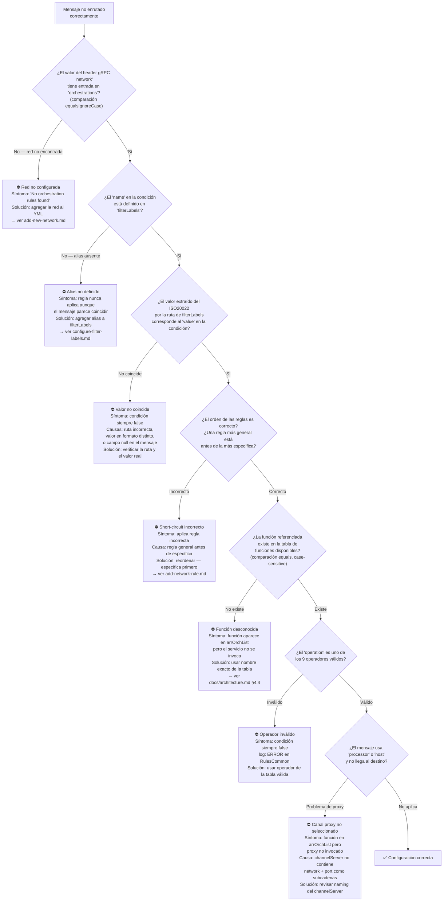

# Skill: troubleshoot-rules

## Cuándo usar este skill
Cuando un mensaje no está siendo enrutado correctamente — se invoca la cadena equivocada,
no se invoca ninguna cadena, o el comportamiento en producción no coincide con el esperado
según el `application-local.yml`.

## Audiencia
Equipo de `kgwy_javalib_orchestrator` y consumidores de `kgwy_javalib_orchestrator`.

## Contexto que Claude necesita antes de ejecutar
- `docs/orchestration-rules-contract.md` — comportamiento certero del motor de reglas
- `docs/configuration-examples/application-local.yml` — estructura de referencia
- El `application-local.yml` del consumidor afectado (el archivo real, no el ejemplo)

---

## Diagrama de diagnóstico



---

## Error 1 — Red no encontrada

**Síntoma:**
- El servicio loguea: `ERROR [OrchestratorService] No orchestration rules found, no BRMS action taken`
- El consumidor recibe la respuesta ISO-8583 pero sin datos de los microservicios
- No hay error gRPC

**Causa:** El valor del header gRPC `network` no coincide con ninguna entrada `network` en `orchestrations`.

**Diagnóstico:**
```
1. Obtener el valor del header 'network' que llega en el request gRPC
2. Buscar en application-local.yml si existe:
   - network: <valor-del-header>    (equalsIgnoreCase)
3. Si no existe → este es el problema
```

**Solución:**
```yaml
local:
  orchestrations:
    - network: PEER01    # existente
      rules: [...]
    - network: PEER03    # ← agregar la red faltante
      rules:
        - filter:
            - condition:
                - name: messageType
                  operation: In
                  value: "0100,0120,0400,0420"
          function: monitor,host
```

---

## Error 2 — Alias no definido en filterLabels

**Síntoma:**
- Una regla nunca aplica aunque el mensaje parece cumplir la condición
- No hay log de error — el fallo es silencioso
- Otras reglas (sin esa condición) sí aplican correctamente

**Causa:** El campo `name` de la condición referencia un alias que no está en `local.filterLabels`.

**Diagnóstico:**
```
1. Tomar el valor del campo 'name' de la condición sospechosa, e.g.: "transactionType"
2. Buscar en application-local.yml la sección filterLabels:
   local:
     filterLabels:
       messageType: ...   # ← ¿está "transactionType" aquí?
3. Si no está → este es el problema
```

**Solución:**
```yaml
local:
  filterLabels:
    messageType: AddendumData/AdditionalData("UNSP")/Value   # existente
    transactionType: Transaction/TransactionType              # ← agregar el alias faltante
```

---

## Error 3 — Short-circuit incorrecto

**Síntoma:**
- El mensaje aplica la cadena equivocada (e.g., `monitor,host` en lugar de `crypto,monitor,fraud,host`)
- La regla esperada sí está en el YML, pero "nunca llega" a evaluarse
- El comportamiento es consistente para un mismo tipo de mensaje

**Causa:** Una regla más general está **antes** que la regla específica esperada. La regla general
intercepta el mensaje primero (short-circuit) y la específica nunca se evalúa.

**Diagnóstico:**
```
1. Identificar qué regla está aplicando actualmente
   (buscar en los logs el valor de arrOrchList o la función que se ejecutó)
2. Leer las reglas en order en el YML para la red afectada
3. Verificar si ANTES de la regla esperada hay una regla cuya condición
   también es verdadera para el mensaje problemático
```

**Ejemplo real de PEER01:**
```yaml
# ❌ Orden incorrecto — la regla general intercepta el 0100 específico
rules:
  - filter:
      - condition:
          - name: messageType
            operation: In
            value: "0100,0120,0400,0420,0101,0401"   # ← captura 0100
    function: monitor,host                            # ← regla general
  - filter:
      - condition:
          - name: messageType
            operation: Equals
            value: "0100"                             # ← NUNCA alcanzada
    function: crypto,monitor,fraud,host               # ← regla específica

# ✅ Orden correcto — la regla específica va primero
rules:
  - filter:
      - condition:
          - name: messageType
            operation: Equals
            value: "0100"                             # ← específica primero
    function: crypto,monitor,fraud,host
  - filter:
      - condition:
          - name: messageType
            operation: In
            value: "0100,0120,0400,0420,0101,0401"   # ← general después
    function: monitor,host
```

---

## Error 4 — Función desconocida (no invocada silenciosamente)

**Síntoma:**
- La función aparece en el campo `function` del YML
- Los logs muestran que la regla aplicó (la red y el tipo de mensaje son correctos)
- Pero el microservicio correspondiente **no se invoca**
- No hay error ni log de advertencia para esa función

**Causa:** El string de función en el YML no coincide exactamente (case-sensitive) con la
constante Java en `OrchestrationsHandler`.

**Diagnóstico:**
```
1. Tomar el string exacto del campo 'function' con el nombre sospechoso
2. Compararlo contra la tabla de funciones disponibles (docs/architecture.md §4.4)
3. Verificar mayúsculas/minúsculas — "Monitor" ≠ "monitor"
```

**Funciones válidas (exactas, case-sensitive):**
`crypto`, `monitor`, `fraud`, `fraudasync`, `dialog`, `dialogcontrol`, `apiconnector`,
`dummyprocessor`, `events`, `flowhandler`, `flowhandlerasync`, `feedbackfraud`, `uncrypto`,
`updatemonitor`, `processor`, `host`

**Solución:**
```yaml
# ❌ Incorrecto
function: Monitor,host          # "Monitor" con mayúscula → ignorado
function: flow_handler,host     # underscore → ignorado (es "flowhandler")
function: updateMonitor,host    # camelCase → ignorado (es "updatemonitor")

# ✅ Correcto
function: monitor,host
function: flowhandler,host
function: updatemonitor,host
```

---

## Error 5 — Canal proxy no seleccionado

**Síntoma:**
- La función `processor` o `host` aparece en `arrOrchList` (la regla aplica correctamente)
- No hay error gRPC
- El sistema destino no recibe el mensaje ISO-8583
- Los logs muestran un error de proxy o simplemente no hay actividad

**Causa:** Ningún `ChannelGrpc` configurado para proxy tiene un `channelServer` que contenga
tanto el `network` como el `port` del header gRPC como subcadenas.

**Diagnóstico:**
```java
// OrchestrationsHandler.processProxyRule() — lógica de selección
String network = GrpcHeadersInfo.getNetwork().toLowerCase();  // e.g., "peer01"
String port    = GrpcHeadersInfo.getPort();                   // e.g., "9090"
// clusterPort sobreescribe port si está presente

// Para cada ChannelGrpc en la lista:
if (channelName.contains(network) && channelName.contains(port)) { ... }
```

Verificar en `application.yml` que el `channelServer` del proxy contiene ambas subcadenas:

```yaml
# ❌ channelServer que no coincide para network=peer01, port=9090
grpc.client.global.services.host[0].channelServer: proxy-host.bbva.internal

# ✅ channelServer que sí coincide
grpc.client.global.services.host[0].channelServer: peer01-host-9090.bbva.internal
#                                                   ^^^^^^ contiene "peer01" y "9090"
```

---

## Error 6 — Orden en `function` confundido con orden de ejecución

**Síntoma:**
- El consumidor espera que `function: fraud,monitor,host` ejecute fraud antes que monitor
- En realidad monitor siempre se ejecuta antes que fraud (pos 2 vs pos 3 en el código)

**Causa:** El campo `function` es una **lista de presencia**, no de orden. El orden de ejecución
está hardcodeado en `OrchestrationsHandler.processOrchestrationRules()`.

**Orden real de ejecución (fijo en Java):**

| Pos | Función | Notas |
|---|---|---|
| 1 | `crypto` | Siempre primero si está en la lista |
| 2 | `monitor` | Siempre segundo si está |
| 3 | `fraud` | Solo si `check_crypto=false` en traceData |
| 4 | `fraudasync` | Solo si `check_crypto=false` |
| 5 | `dialog` | Solo si `check_crypto=false` |
| 6 | `dialogcontrol` | Solo si `check_crypto=false` |
| 7 | `apiconnector` | Solo si `check_crypto=false` |
| 8 | `dummyprocessor` | Solo si `check_crypto=false` |
| 9 | `events` | Solo si `check_crypto=false` |
| 10 | `flowhandler` | Solo si `check_crypto=false` |
| 11 | `flowhandlerasync` | Solo si `check_crypto=false` |
| 12 | `feedbackfraud` | Solo si `check_crypto=false` |
| 13 | `uncrypto` | Solo si `check_crypto=false` |
| 14 | `updatemonitor` | Solo si `check_crypto=false` |
| 15 | `processor` / `host` | Siempre al final (async fire-and-forget) |

> Si `crypto` falla, escribe `check_crypto=true` en traceData y **los pasos 3-14 se saltan**.
> Solo se ejecutan crypto (ya falló), monitor y el proxy.

---

## Cómo verificar qué regla aplicó a un mensaje

kgwy almacena la función activa en `RulesLocalUtils` durante la evaluación:

```java
// RulesCommon.addFunctionsFromRulesList() — al encontrar match
RulesLocalUtils.setOrchestrations(function);  // guarda la cadena activa
```

Para diagnosticar en un entorno con acceso a logs:
1. Buscar en los logs `[OrchestratorService]` la entrada de `arrOrchList` o la función ejecutada.
2. Si los logs no lo muestran explícitamente, agregar temporalmente un `LogsTraces.writeInfo` en
   `OrchestratorService.processISO20022()` justo después de obtener `arrOrchList`.

Para diagnosticar sin acceso a logs en producción:
1. Revisar el `traceData` del ISO20022 de respuesta — cada servicio que falla escribe `gw_error_callXxxService`.
2. Los servicios que se invocaron exitosamente no dejan traza directa, pero su efecto
   (enriquecimiento del ISO20022) sí es visible en el mensaje de respuesta.

---

## Checklist de diagnóstico completo

- [ ] Verificar que el header gRPC `network` tiene valor y coincide (ignoreCase) con alguna entrada en `orchestrations`
- [ ] Verificar que el header gRPC `port` tiene valor (requerido para selección de proxy)
- [ ] Verificar que todos los `name` en las condiciones están en `local.filterLabels`
- [ ] Verificar que las rutas en `filterLabels` corresponden a getters reales del ISO20022
- [ ] Verificar que los `value` en las condiciones coinciden exactamente con los valores que el mensaje tiene en ese campo (mismo formato de string)
- [ ] Revisar el orden de las reglas — la regla más específica antes de la más general
- [ ] Verificar que las funciones en `function` están escritas en minúsculas y sin typos
- [ ] Si se usa `processor` o `host`: verificar que el `channelServer` del proxy contiene `network` + `port`
- [ ] Verificar los 9 operadores válidos si la condición usa uno poco común

---

## Cómo invocar este skill con Claude Code

```
execute docs/claude-skills/troubleshoot-rules.md
```
