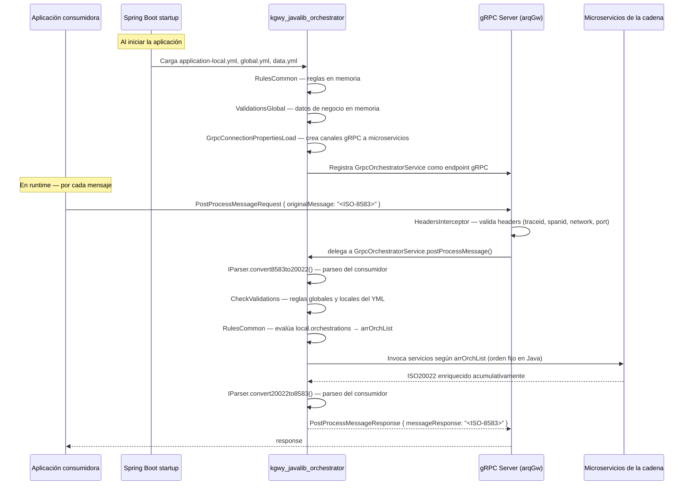

# orchestratorlib-contract.md
# Contrato de uso de kgwy_javalib_orchestrator
# para componentes consumidores

## Cómo usar este documento

Este archivo está diseñado para ser **copiado** a:
```
dependencies/kgwy_javalib_orchestrator/orchestratorlib-contract.md
```
dentro del proyecto consumidor (e.g., `pgwp_java_orchestrator`).

Una vez copiado, Claude lo leerá automáticamente antes de analizar cualquier código
del consumidor gracias a las instrucciones en su `CLAUDE.md`.

## Versión de kgwy_javalib_orchestrator documentada
`com.bbva.orchlib:orchestratorlib:2.16.0` sobre `arqGw 2.13.0`

## Fecha de generación
2026-02-28 — Generado con `prompts/phase5-orchLib-contract.md`

## Cuándo actualizar este documento
- Cuando kgwy_javalib_orchestrator publique una nueva versión minor o mayor
- Cuando cambie la estructura del YML esperado (`local.*`)
- Cuando se agreguen o eliminen funciones disponibles
- Para regenerar: ejecutar en el repositorio de kgwy_javalib_orchestrator:
  `execute prompts/phase5-orchLib-contract.md`

---

## 1. Resumen ejecutivo — Para Claude

`kgwy_javalib_orchestrator` es un **motor de orquestación dinámica de microservicios gRPC**
para el gateway financiero BBVA. Su característica principal es que la cadena de servicios
**NO es fija** — se construye en runtime evaluando reglas que el consumidor define en su
`application-*.yml`.

### Lo más importante que Claude debe saber

1. **La cadena de servicios es DINÁMICA**: definida por reglas YML del consumidor, no
   hardcodeada en kgwy. Cuando veas `local.orchestrations` en el YML del consumidor,
   esas son las reglas que determinan qué microservicios se invocan para cada mensaje.

2. **El consumidor controla la lógica de enrutamiento**: qué servicios invocar, para qué
   tipo de mensaje, y en qué red — todo vía el YML. Cambiar el comportamiento **no requiere
   tocar código Java de kgwy**.

3. **El orden de las reglas en el YML importa**: evaluación secuencial con short-circuit —
   la primera regla cuyas condiciones sean verdaderas gana; las demás no se evalúan.

4. **El campo `function` es lista de presencia, no de orden**: `function: host,monitor`
   NO significa que `host` se ejecuta antes que `monitor`. El orden de ejecución está fijo
   en el código Java de kgwy (ver tabla completa en §4).

5. **Los errores de la cadena van en `traceData`**, no como excepciones gRPC. El consumidor
   siempre recibe una respuesta ISO-8583, pero debe inspeccionar `traceData` para detectar
   fallos parciales en la cadena.

### Lo que kgwy_javalib_orchestrator hace automáticamente

El consumidor **NO necesita implementar** esto:

- Evaluación de reglas BRMS contra el ISO-20022
- Mapeo de nombre de función → cliente gRPC del microservicio
- Invocación secuencial de la cadena de servicios
- Propagación de trazabilidad (`LogsTraces`, `traceid`, `spanid`) entre microservicios
- Manejo de errores de la cadena (serialización en `traceData`)
- Gestión y reutilización de canales gRPC hacia los microservicios
- Mecanismo de contingencia (re-ejecución automática si `check_contingency=true`)
- Cortocircuito de seguridad post-fallo de Crypto (`check_crypto=true` → salta pasos 3-14)

### Lo que el consumidor DEBE proveer

Claude debe verificar que estos elementos existen en el proyecto consumidor:

| Elemento | Tipo | Dónde | Obligatorio |
|---|---|---|---|
| `IParser` implementado | Spring Bean | Código Java del consumidor | Sí |
| `IGrpcControlDialogoClient` implementado | Spring Bean | Código Java del consumidor | Sí |
| `IGrpcDummyClient` implementado | Spring Bean | Código Java del consumidor | Sí |
| `IValidationsLocal` implementado | Spring Bean | Código Java del consumidor | Sí |
| `IValidationsLocalErr` implementado | Spring Bean | Código Java del consumidor | Sí ⚠️ |
| `local.orchestrations` | `application-local.yml` | Resources del consumidor | Sí |
| `local.filterLabels` | `application-local.yml` | Resources del consumidor | Sí |
| `global.validations` | `application-global.yml` | Resources del consumidor | Sí |
| `application-data.yml` con BINs y monedas | Resources del consumidor | Sí |
| `application-datalocal.yml` con códigos de respuesta | Resources del consumidor | Sí |
| `grpc.client.global.services.*` | `application.yml` | Resources del consumidor | Sí |
| 3 variables de entorno de proxy keep-alive | Infraestructura/ops | Sí (⚠️ sin fallback) |

> ⚠️ `IValidationsLocalErr` no está documentado en el CONTRACT.md de arqGw pero sí
> es inyectado por `CheckValidations` — su ausencia causará fallo de startup de Spring.

### Cuando veas referencias a kgwy_javalib_orchestrator en el código del consumidor

| Si ves en el código del consumidor | Significa |
|---|---|
| Implementación de `IParser` | El consumidor provee la lógica de parseo ISO-8583 ↔ ISO-20022 |
| Implementación de `IGrpcControlDialogoClient` | El consumidor provee su cliente de diálogo específico |
| Implementación de `IGrpcDummyClient` | El consumidor provee su procesador de prueba |
| Implementación de `IValidationsLocal` | El consumidor provee validaciones locales de negocio |
| Implementación de `IValidationsLocalErr` | El consumidor provee el handler de errores de validación local |
| `local.orchestrations` en el YML | Reglas que determinan qué microservicios invocar — el corazón del comportamiento |
| `local.filterLabels` en el YML | Mapeo alias → campo ISO-20022 para las condiciones de las reglas |
| `function: monitor,host` en el YML | kgwy invocará `MonitorService` y `ProxyService` (en ese orden según el código) |
| `grpc.client.global.services.*` | Host/puerto de cada microservicio de la cadena |

---

## 2. Cómo se activa kgwy_javalib_orchestrator

### Mecanismo de activación

`kgwy_javalib_orchestrator` se activa **automáticamente** al incluirlo como dependencia JAR.
Spring Boot descubre sus `@Component`, `@Configuration` y `@GrpcService` por component scan.
El consumidor no instancia ninguna clase de kgwy manualmente.

Al arrancar Spring Boot:
1. `RulesLocalLoad` carga `application-local.yml` → popula `RulesCommon` (singleton estático)
2. `RulesGlobalLoad` carga `application-global.yml` → popula `RulesCommon`
3. `BusinessDataLoad` carga `application-data.yml` → popula `ValidationsGlobal`
4. `BusinessDataLocalLoad` carga `application-datalocal.yml` → popula `ValidationsGlobal`
5. `GrpcConnectionPropertiesLoad` lee `grpc.client.global.services.*` y crea los canales gRPC

En runtime, cada mensaje gRPC entrante lo procesa `GrpcOrchestratorService` directamente.

### Lo que el consumidor NO necesita hacer

- No instanciar `OrchestratorService`, `OrchestrationsHandler` ni ninguna clase de kgwy
- No implementar la lógica de evaluación de reglas
- No configurar stubs gRPC hacia los microservicios de la cadena
- No interactuar con arqGw directamente (salvo proveer las 5 interfaces requeridas)
- No gestionar los canales gRPC de la cadena

### Diagrama de activación



---

## 3. Contrato de configuración YML

### Por qué el YML vive en el consumidor, no en kgwy

`kgwy_javalib_orchestrator` no tiene `application-*.yml` propio para las reglas de orquestación.
Spring Boot las carga automáticamente desde el classpath del proyecto consumidor por
convención de perfiles (`spring.profiles.active`). **El consumidor es dueño de sus reglas.**
kgwy solo las interpreta.

### Archivos de configuración requeridos

| Archivo | Prefijo raíz | Clase que lo lee | Contenido |
|---|---|---|---|
| `application-local.yml` | `local:` | `RulesLocalLoad` | Reglas de orquestación por red + validaciones locales |
| `application-global.yml` | `global:` | `RulesGlobalLoad` | Validaciones globales por red + filterLabels globales |
| `application-data.yml` | (libre) | `BusinessDataLoad` | BINs válidos y monedas válidas para `ValidationsGlobal` |
| `application-datalocal.yml` | (libre) | `BusinessDataLocalLoad` | Processing codes válidos por red |

### Estructura mínima obligatoria de application-local.yml

```yaml
local:
  filterLabels:
    messageType: AddendumData/AdditionalData("UNSP")/Value
    pan: Environment/Card/Pan
    # Agregar aliases adicionales según necesidad
    # Formato: alias: Ruta/En/ISO20022 (separada por /)
    # Ejemplo: transactionType: Transaction/TransactionType

  orchestrations:
    - network: PEER01            # Nombre de red — comparación equalsIgnoreCase con header gRPC 'network'
      rules:
        # Cada regla: primera que aplica gana (short-circuit)
        - filter:
            - condition:
                - name: messageType          # Alias definido en filterLabels
                  operation: In             # Operador (ver tabla de operadores)
                  value: "0100,0120,0400,0420"
          function: monitor,host            # Funciones a activar (ver tabla de funciones)
        - filter:
            - condition:
                - name: messageType
                  operation: In
                  value: "0110,0130,0410,0430"
          function: updatemonitor,processor

  validations:    # Misma estructura que orchestrations — puede estar vacío
    - network: PEER01
      rules: []
```

### Funciones disponibles para el campo `function`

Estas son las **únicas** funciones válidas. No se pueden usar otras sin modificar el
código Java de kgwy. La comparación es `equals()` — sensible a mayúsculas, siempre en minúsculas.

| Función | Microservicio que invoca | Pos. en cadena | Propósito |
|---|---|---|---|
| `crypto` | CryptoService.Tokenize | 1 — siempre primero | Tokeniza datos sensibles de tarjeta |
| `monitor` | MonitorService.PostPatchInsertDocument | 2 — siempre segundo | Registra estado inicial de la transacción |
| `fraud` | FraudService.GetFraudInfo | 3 | Consulta antifraude (bloqueante) |
| `fraudasync` | FraudService.GetFraudInfoAsync | 4 | Consulta antifraude (async en FraudService, bloqueante en kgwy) |
| `dialog` | IGrpcControlDialogoClient (consumidor) | 5 | Diálogo específico del consumidor |
| `dialogcontrol` | DialogControlService.Process (arqGw) | 6 | Control de diálogo estándar |
| `apiconnector` | ApiConnectorService.SendAPIConnector | 7 | Conexión a API externa |
| `dummyprocessor` | IGrpcDummyClient (consumidor) | 8 | Procesador de prueba del consumidor |
| `events` | EventService.PostEvent | 9 | Publica evento de negocio |
| `flowhandler` | FlowHandlerService.SendResolverConnector | 10 | Manejador de flujo (síncrono) |
| `flowhandlerasync` | FlowHandlerService.SendResolverConnectorAsync | 11 | Manejador de flujo (asíncrono) |
| `feedbackfraud` | FraudService.PostFeedBackFraud | 12 | Retroalimentación al antifraude |
| `uncrypto` | CryptoService.Untokenize | 13 | Destokeniza datos de tarjeta |
| `updatemonitor` | MonitorService.PostPatchUpdateDocument | 14 | Actualiza estado final de la transacción |
| `processor` | ProxyService.PostData (async, ISO-8583) | 15 (final) | Envía al procesador legacy (fire-and-forget) |
| `host` | ProxyService.PostData (async, ISO-8583) | 16 (final) | Envía al host emisor (fire-and-forget) |

> **CRÍTICO**: El orden en el string `function` no define el orden de ejecución.
> `function: host,monitor` ejecuta `monitor` en posición 2 y `host` en posición 16
> — el orden está fijo en el código Java de `OrchestrationsHandler`.
>
> Los pasos 3-14 se **saltan automáticamente** si `CryptoService` falla
> (`check_crypto=true` en `traceData`). Diseñar las reglas considerando este comportamiento.

### Operadores disponibles en las condiciones

| Operador | Comportamiento | Ejemplo de `value` |
|---|---|---|
| `Equals` | Igualdad exacta de strings | `"0800"` |
| `NotEquals` | Desigualdad de strings | `"0800"` |
| `In` | El valor está en lista separada por comas | `"0100,0120,0400"` |
| `NotIn` | El valor NO está en la lista | `"0110,0130"` |
| `StartWith` | El valor comienza con el prefijo dado | `"01"` |
| `EndWith` | El valor termina con el sufijo dado | `"00"` |
| `Greater` | Comparación numérica — mayor que | `"100"` |
| `Lower` | Comparación numérica — menor que | `"200"` |
| `Range` | El valor está en el rango numérico [min,max] | `"100,200"` |

Si el operador no es ninguno de los anteriores, la condición retorna `false` silenciosamente.

### Reglas de evaluación que el consumidor debe respetar

1. **Short-circuit**: la primera regla cuyas condiciones sean todas verdaderas gana. Las siguientes no se evalúan.
2. **AND entre condiciones**: si una regla tiene múltiples `condition`, **todas** deben ser verdaderas.
3. **El alias en `name` debe estar en `filterLabels`**: si no está definido, la condición retorna `false` silenciosamente.
4. **Las funciones deben existir en la tabla anterior**: funciones desconocidas se ignoran sin error.
5. **El orden de las reglas en el YML importa**: las más específicas deben ir antes que las más generales.
6. **La red en el YML se compara `equalsIgnoreCase`** con el header gRPC `network` del mensaje.

### Ejemplo de referencia — configuración completa PEER01 y PEER02

Ver `docs/configuration-examples/application-local.yml` en el repositorio de kgwy_javalib_orchestrator.

```yaml
# Fragmento real de docs/configuration-examples/application-local.yml
local:
  filterLabels:
    pan: Environment/Card/Pan
    messageType: AddendumData/AdditionalData("UNSP")/Value
  orchestrations:
    - network: PEER01
      rules:
        - filter:
            - condition:
                - name: messageType
                  operation: In
                  value: "0100,0120,0400,0420,0101,0401"
          function: monitor,host
        - filter:
            - condition:
                - name: messageType
                  operation: In
                  value: "0110,0130,0410,0430"
          function: updatemonitor,processor
        - filter:
            - condition:
                - name: messageType
                  operation: Equals
                  value: "0800"
          function: processor
        - filter:
            - condition:
                - name: messageType
                  operation: Equals
                  value: "0810"
          function: host
    - network: PEER02
      rules:
        - filter:
            - condition:
                - name: messageType
                  operation: In
                  value: "0100,0120,0400,0420"
          function: monitor,host
        - filter:
            - condition:
                - name: messageType
                  operation: In
                  value: "0110,0130,0410,0430"
          function: updatemonitor,processor
        - filter:
            - condition:
                - name: messageType
                  operation: Equals
                  value: "0800"
          function: processor
        - filter:
            - condition:
                - name: messageType
                  operation: Equals
                  value: "0810"
          function: host
```

---

## 4. Interfaces (puertos) que el consumidor debe implementar

El consumidor debe proveer exactamente **5 Spring beans** implementando estas interfaces:

```java
// Parseo ISO-8583 ↔ ISO-20022
// Package: com.bbva.orchlib.parser
public interface IParser {
    ISO20022 convert8583to20022(String iso8583Message) throws ParserException;
    String convert20022to8583(ISO20022 iso20022) throws ParserException;
}

// Cliente gRPC para el servicio de diálogo específico del consumidor
// Package: com.bbva.orchlib.grpcclient
public interface IGrpcControlDialogoClient {
    ISO20022 callControlDialogoService(String server, int port, ISO20022 iso20022);
}

// Cliente gRPC para el procesador de prueba del consumidor
// Package: com.bbva.orchlib.grpcclient
public interface IGrpcDummyClient {
    ISO20022 callDummyService(String server, int port, ISO20022 iso20022);
}

// Validaciones locales de negocio del consumidor
// Package: com.bbva.orchlib.validations (inferido)
// ⚠️ El retorno boolean es ignorado en OrchestratorService actualmente
public interface IValidationsLocal {
    boolean validationsLocal(ISO20022 iso20022);
}

// Handler de errores de validación local
// Package: com.bbva.orchlib.validations (inferido)
// ⚠️ No documentado en CONTRACT.md — pero requerido por CheckValidations
public interface IValidationsLocalErr {
    // firma exacta a confirmar con el código fuente de kgwy
}
```

---

## 5. Properties técnicas requeridas del consumidor

### Conexiones a microservicios (`application.yml`)

```yaml
grpc:
  client:
    global:
      services:
        monitor:
          channelServer: <host-monitor>
          channelPort: <puerto>
        flowhandler:
          channelServer: <host-flowhandler>
          channelPort: <puerto>
        fraud:
          channelServer: <host-fraud>
          channelPort: <puerto>
        crypto:
          channelServer: <host-crypto>
          channelPort: <puerto>
        apiconnector:
          channelServer: <host-apiconnector>
          channelPort: <puerto>
        dummyprocessor:
          channelServer: <host-dummyprocessor>
          channelPort: <puerto>
        dialog:
          channelServer: <host-dialog>
          channelPort: <puerto>
        dialogcontrol:
          channelServer: <host-dialogcontrol>
          channelPort: <puerto>
        events:
          channelServer: <host-events>
          channelPort: <puerto>
        # Proxies — lista; el channelServer DEBE contener network + port como subcadenas
        host:
          - channelServer: <peer01-host-9090.hostname>   # debe contener "peer01" y "9090"
            channelPort: <puerto>
        processor:
          - channelServer: <peer01-processor-9090.hostname>
            channelPort: <puerto>
```

> ⚠️ **Regla de naming para proxies**: el `channelServer` de cada entrada en `host` y `processor`
> **debe contener** el nombre de la red y el puerto como subcadenas en su hostname.
> El selector usa `channelName.contains(network) && channelName.contains(port)`.
> Si no hay coincidencia, el proxy no se invoca y no se produce error explícito.

### Variables de entorno (Infraestructura/Ops)

Estas 3 variables son **obligatorias** — kgwy no tiene fallback y arroja `NullPointerException`
o `NumberFormatException` en startup si no están definidas:

| Variable | Tipo | Descripción |
|---|---|---|
| `ORCHESTRATION_PROXY_GRPC_CLIENT_KEEP_ALIVE_TIME` | Long (segundos) | Tiempo de keep-alive para canales proxy |
| `ORCHESTRATION_PROXY_GRPC_CLIENT_KEEP_ALIVE_TIMEOUT` | Long (segundos) | Timeout de keep-alive para canales proxy |
| `ORCHESTRATION_PROXY_GRPC_CLIENT_KEEP_ALIVE_WITHOUT_CALLS` | Boolean (`"true"`/`"false"`) | Mantener keep-alive sin llamadas activas |

---

## 6. Contrato de errores

### Filosofía de errores de kgwy

kgwy **nunca lanza excepciones gRPC** durante la cadena de orquestación. Los errores van
serializados en `traceData` del ISO-20022 y el consumidor siempre recibe una respuesta
`PostProcessMessageResponse` en el `finally`. La excepción a esta regla es antes del inicio
del procesamiento (headers faltantes).

### Errores que el consumidor puede recibir

**1. `StatusRuntimeException(INVALID_ARGUMENT)` — antes del procesamiento**
- **Origen**: `HeadersInterceptor` de arqGw
- **Cuándo**: falta alguno de los 4 headers gRPC obligatorios (`traceid`, `spanid`, `network`, `port`)
- **Cómo llega**: como `StatusRuntimeException` al cliente gRPC del consumidor
- **Acción**: el consumidor debe asegurarse de incluir los 4 headers en cada request

**2. `ParserException` — en el parseo (deprecated)**
- **Origen**: implementación de `IParser` del propio consumidor
- **Cuándo**: `IParser.convert8583to20022()` falla
- **Cómo llega**: kgwy la captura y retorna el mensaje de error como String en `PostProcessMessageResponse.messageResponse`
- **⚠️ Deprecated desde 2.16.0** — preferir manejar el error internamente en `IParser` y retornar un ISO20022 de error

**3. Errores en `traceData` — durante la cadena**
- **Origen**: cualquier microservicio de la cadena que falla
- **Cuándo**: cualquier `Exception` en un cliente gRPC de kgwy
- **Cómo llega**: clave `gw_error_call<NombreServicio>Service` en `traceData` del ISO-20022
- **El consumidor no recibe excepción**: recibe `PostProcessMessageResponse` normal con el error en traceData
- **Acción**: el consumidor debe leer `traceData` para detectar fallos parciales

Claves de error conocidas en `traceData`:

| Clave | Servicio que la escribe | Significado adicional |
|---|---|---|
| `gw_error_callCryptoService` | GrpcCryptoClient | Error en tokenización |
| `check_crypto` | GrpcCryptoClient | Si es `"true"`: pasos 3-14 se saltan (crypto falló) |
| `gw_error_callMonitorService` | GrpcMonitorClient | Error en registro inicial |
| `gw_error_callFraudService` | GrpcFraudClient | Error en antifraude |
| `check_beaEvent` | GrpcEventsClient | Si es `"false"`: events falló |
| `gw_error_callEventsService` | GrpcEventsClient | Error al publicar evento |
| `gw_error_callFlowHandlerService` | GrpcFlowHandlerClient | Error en flow handler |
| `gw_error_callApiConnectorService` | GrpcApiconnectorClient | Error en API connector |
| `check_contingency` | Microservicio externo | Si es `"true"`: kgwy re-ejecutará toda la orquestación |

### Comportamiento en fallo parcial de la cadena

La cadena **nunca se detiene** por un error de un servicio (salvo la señal `check_crypto=true`).
El consumidor siempre recibe el ISO-20022 con el estado que tenía en el último paso exitoso,
más las claves de error en `traceData`. No hay rollback.

### Timeout

kgwy no configura un timeout global sobre la cadena completa — cada canal gRPC individual
tiene keep-alive de 1200 s. El consumidor debe configurar su propio timeout para el
`PostProcessMessage` request teniendo en cuenta que la cadena puede invocar hasta 16
microservicios secuencialmente.

---

## 7. Lo que kgwy_javalib_orchestrator abstrae del consumidor

### El consumidor NO necesita conocer esto

**Del protocolo gRPC:**
- Stubs gRPC hacia los microservicios de la cadena (`CryptoServiceGrpc`, `FraudServiceGrpc`, etc.)
- Gestión y reutilización de canales `ManagedChannel`
- Configuración de `GrpcClientRequestInterceptor` para propagación de trazabilidad
- Serialización/deserialización de `Iso20022Request` / `Iso20022Response` Protobuf

**Del motor de reglas:**
- Cómo kgwy evalúa las condiciones del YML internamente
- Cómo kgwy construye `arrOrchList` desde el campo `function`
- El mecanismo de `extractValueByMethodSequence` (reflexión sobre ISO-20022)
- Las 9 operaciones de `Operations.*` de arqGw

**De la cadena de servicios:**
- El orden interno de invocación de microservicios (hardcodeado en `OrchestrationsHandler`)
- La implementación interna de cada microservicio (CryptoService, FraudService, etc.)
- El mecanismo de contingencia (`check_contingency`, `check_contingency_retries`)
- El mecanismo de cortocircuito post-Crypto (`check_crypto`)
- La selección de canal proxy por hostname matching

**Del modelo ISO-20022:**
- Los ~100 DTOs del modelo ISO-20022 de arqGw que fluyen entre microservicios
- La conversión Protobuf ↔ DTO (`Convert.map*`)

### Lo que SÍ llega al consumidor transitivamente

Aunque kgwy abstrae mucho, estas dependencias de arqGw sí atraviesan kgwy y llegan
al consumidor. Deben documentarse en `TRANSITIVE-CONTRACT.md` del consumidor:

| Clase de arqGw | Por qué llega al consumidor | Package |
|---|---|---|
| `StatusRuntimeException(INVALID_ARGUMENT)` | Headers obligatorios faltantes | `io.grpc` |
| `ISO20022` y sus DTOs | `IParser` recibe y retorna `ISO20022` | `com.bbva.gateway.dto.*` |
| `ParserException` | El consumidor la lanza desde `IParser` | `com.bbva.orchlib.parser` |
| `LogsTraces` | Si el consumidor usa trazabilidad en sus implementaciones | `com.bbva.gateway.util` |
| `GrpcHeadersInfo` | Si el consumidor lee headers en sus implementaciones (`IParser`, etc.) | `com.bbva.gateway.util` |

---

## 8. Skills disponibles para el consumidor

### Skills de kgwy_javalib_orchestrator para consumidores

Disponibles en `docs/claude-skills/` del repositorio de kgwy_javalib_orchestrator.
Copiar a `dependencies/kgwy_javalib_orchestrator/claude-skills/` en el proyecto consumidor.

| Skill | Cuándo usarlo |
|---|---|
| `add-network-rule.md` | Agregar una regla a una red existente en el YML |
| `add-new-network.md` | Agregar una red completamente nueva al YML |
| `configure-filter-labels.md` | Agregar o modificar aliases de campos en `filterLabels` |
| `troubleshoot-rules.md` | Diagnosticar por qué un mensaje no se enruta correctamente |

### Skills de arqGw disponibles transitivamente

Disponibles en `dependencies/kgwy_javalib_gateway/claude-skills/` del repositorio de kgwy.

| Skill | Cuándo usarlo |
|---|---|
| `use-logtraces.md` | Implementar trazabilidad con `LogsTraces` |
| `handle-arqgw-errors.md` | Manejar errores de arqGw (`InternalServerException`, `StatusRuntimeException`) |

### Cómo invocar un skill desde el proyecto consumidor

```
execute dependencies/kgwy_javalib_orchestrator/claude-skills/add-network-rule.md
execute dependencies/kgwy_javalib_orchestrator/claude-skills/troubleshoot-rules.md
```

---

## 9. Guía de integración rápida

### Paso 1 — Agregar la dependencia

```xml
<!-- pom.xml del consumidor -->
<dependency>
    <groupId>com.bbva.orchlib</groupId>
    <artifactId>orchestratorlib</artifactId>
    <version>2.16.0</version>
</dependency>
```

### Paso 2 — Implementar los 5 puertos requeridos

```java
@Component
public class MiParser implements IParser {
    @Override
    public ISO20022 convert8583to20022(String iso8583Message) throws ParserException {
        // lógica de parseo ISO-8583 → ISO-20022
    }
    @Override
    public String convert20022to8583(ISO20022 iso20022) throws ParserException {
        // lógica de serialización ISO-20022 → ISO-8583
    }
}

// Ídem para IGrpcControlDialogoClient, IGrpcDummyClient,
// IValidationsLocal e IValidationsLocalErr
```

### Paso 3 — Configurar el YML mínimo

Copiar la estructura de `application-local.yml` de la Sección 3 y adaptar:
- Reemplazar `PEER01`/`PEER02` con las redes reales del consumidor
- Adaptar los tipos de mensaje ISO 8583 que manejará cada red
- Elegir las funciones de la tabla de la Sección 3 para cada regla

### Paso 4 — Configurar las conexiones a microservicios

En `application.yml`, completar `grpc.client.global.services.*` con los hosts/puertos reales
para cada microservicio de la cadena (ver Sección 5).

### Paso 5 — Definir las variables de entorno de proxy

Asegurarse de que las 3 variables `ORCHESTRATION_PROXY_GRPC_CLIENT_*` están definidas
en el entorno de ejecución antes del startup (ver Sección 5).

### Verificación del startup

Al iniciar correctamente, los logs deben mostrar la carga exitosa de los YAMLs sin
errores de `@PostConstruct`. Si hay errores de configuración típicos:

| Error en startup | Causa | Solución |
|---|---|---|
| `NullPointerException` en `GrpcConnectionPropertiesLoad` | Variable de entorno de proxy no definida | Definir las 3 variables `ORCHESTRATION_PROXY_GRPC_CLIENT_*` |
| `NoSuchBeanDefinitionException: IParser` | No hay implementación de `IParser` como Spring bean | Implementar `IParser` y anotarla con `@Component` |
| `NoSuchBeanDefinitionException: IValidationsLocalErr` | Falta el 5° puerto | Implementar `IValidationsLocalErr` como `@Component` |
| `ConfigurationPropertiesBindException` | Estructura del YML incorrecta | Verificar la estructura contra el ejemplo de la Sección 3 |

### Checklist completo antes de ir a producción

- [ ] Los 5 puertos (`IParser`, `IGrpcControlDialogoClient`, `IGrpcDummyClient`, `IValidationsLocal`, `IValidationsLocalErr`) están implementados como Spring beans
- [ ] `application-local.yml` tiene `local.filterLabels` y `local.orchestrations` con al menos una red
- [ ] `application-global.yml` tiene `global.validations` con las validaciones de negocio
- [ ] `application-data.yml` tiene los BINs y monedas válidos
- [ ] `application-datalocal.yml` tiene los processing codes válidos por red
- [ ] `grpc.client.global.services.*` configurado para todos los microservicios usados en `function`
- [ ] Los `channelServer` de proxies contienen el nombre de red y puerto como subcadenas
- [ ] Las 3 variables `ORCHESTRATION_PROXY_GRPC_CLIENT_*` están definidas en infraestructura
- [ ] Todas las funciones en los campos `function` del YML existen en la tabla de la Sección 3
- [ ] Todas las redes configuradas en el YML coinciden con los valores del header gRPC `network`
- [ ] El timeout del consumidor para `PostProcessMessage` es mayor a la suma de timeouts de todos los microservicios de la cadena más larga
- [ ] El consumidor maneja el caso de errores en `traceData` (no solo el código de estado gRPC)

---

## 10. Versionado y compatibilidad

### Versión documentada
`orchestratorlib 2.16.0` sobre `arqGw 2.13.0`

### Cambios que NO rompen compatibilidad del consumidor

El consumidor **no necesita actualizar nada**:
- Nueva función disponible en el mapeador de kgwy (el consumidor puede opcionalmente usarla)
- Nuevo operador de condición disponible
- Mejoras de performance internas
- Corrección de bugs que no afectan la API pública

### Cambios que SÍ rompen compatibilidad

El consumidor **debe actualizar su integración**:

| Cambio breaking | Impacto en el consumidor |
|---|---|
| Cambio en la estructura del YML (`local.*`) | Todos los `application-local.yml` dejan de funcionar |
| Cambio en el prefijo `local.*` o `global.*` | Los YMLs del consumidor no se cargan |
| Eliminación de una función del mapeador | Las reglas que la usan la ignoran silenciosamente — cambio de comportamiento |
| Cambio en el comportamiento del short-circuit | El orden de evaluación cambia inesperadamente |
| Nueva interfaz requerida sin implementación de fallback | Fallo de startup de Spring |
| Bump de versión de arqGw | Posible incompatibilidad de Protobuf / modelo ISO-20022 |

### Changelog

```
## [2.16.0] — 2026-02-28
### Estado: Versión inicial del contrato
- Generado con: prompts/phase5-orchLib-contract.md
- arqGw: 2.13.0
- Spring Boot: 3.3.4 / Java 17
- Funciones disponibles: 16 (crypto, monitor, fraud, fraudasync, dialog, dialogcontrol,
  apiconnector, dummyprocessor, events, flowhandler, flowhandlerasync, feedbackfraud,
  uncrypto, updatemonitor, processor, host)
- Operadores disponibles: 9 (Equals, NotEquals, Greater, Lower, StartWith, EndWith, In, NotIn, Range)
```

---

## Instrucciones para el equipo consumidor

### Paso 1 — Copiar este archivo al proyecto consumidor

```bash
cp docs/orchestratorlib-contract.md \
   ../pgwp_java_orchestrator/dependencies/kgwy_javalib_orchestrator/orchestratorlib-contract.md
```

### Paso 2 — Copiar los skills útiles para consumidores

```bash
cp docs/claude-skills/add-network-rule.md \
   docs/claude-skills/add-new-network.md \
   docs/claude-skills/configure-filter-labels.md \
   docs/claude-skills/troubleshoot-rules.md \
   docs/claude-skills/README.md \
   ../pgwp_java_orchestrator/dependencies/kgwy_javalib_orchestrator/claude-skills/
```

### Paso 3 — Verificar el CLAUDE.md del consumidor

El `CLAUDE.md` del consumidor debe incluir:

```markdown
## Dependencias de negocio
Lee en este orden antes de analizar cualquier código:

1. dependencies/kgwy_javalib_orchestrator/orchestratorlib-contract.md
   → CRÍTICO: cómo este proyecto usa kgwy_javalib_orchestrator — leer siempre primero

2. dependencies/kgwy_javalib_orchestrator/CONTRACT.md
   → si necesitas profundidad sobre la integración concreta de este consumidor

3. dependencies/kgwy_javalib_gateway/CONTRACT.md
   → solo si necesitas entender qué de arqGw atraviesa kgwy hacia este proyecto
```

### Paso 4 — Generar el CONTRACT.md del consumidor

Con este archivo disponible, ejecutar en el proyecto consumidor:
```
execute prompts/generate-consumer-contract.md
```
