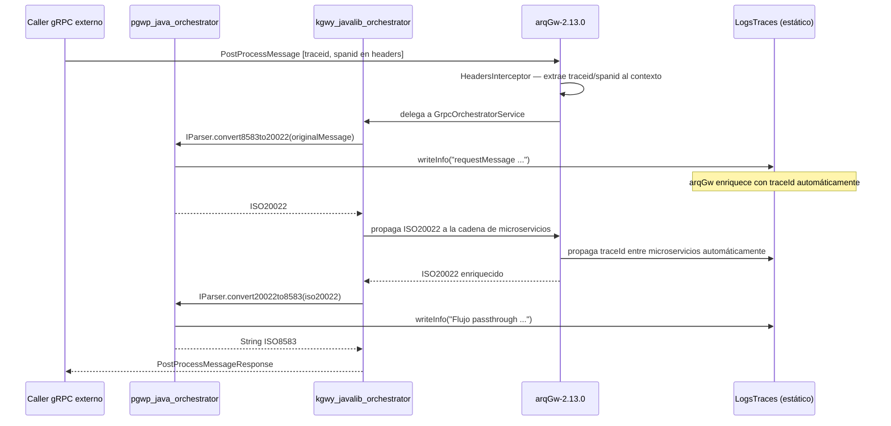

# TRANSITIVE-CONTRACT.md
# Clases de arqGw visibles en pgwp_java_orchestrator

## Por qué existe este archivo

arqGw (`kgwy_javalib_gateway`) es dependencia interna de
`kgwy_javalib_orchestrator`, no de `pgwp_java_orchestrator` directamente.
Sin embargo las siguientes clases de arqGw atraviesan kgwy y son usadas
directamente en `pgwp_java_orchestrator`.

Este archivo documenta SOLO esa superficie transitiva.

Documentación completa de kgwy disponible en:
`dependencies/kgwy_javalib_orchestrator/` (orchestratorlib-contract.md y architecture.md)

**Versión de arqGw referenciada:** 2.13.0 (vía `orchestratorlib 2.16.0`)

## Clases de arqGw confirmadas en pgwp_java_orchestrator

- **`LogsTraces`**: `com.bbva.gateway.utils.LogsTraces`
- **`GrpcHeadersInfo`**: `com.bbva.gateway.interceptors.GrpcHeadersInfo`
- **ISO-20022 DTOs**: `com.bbva.gateway.dto.iso20022.*`
- **ComponentScan de `com.bbva.gateway`**: pgwp incluye el paquete base de
  arqGw en su `@ComponentScan` para auto-descubrir sus beans Spring
  (incluyendo `HeadersInterceptor`)
- **Exclusiones explícitas de arqGw**: `DialogControlHandler`,
  `GrpcDialogControlService`, `IDialogControl` — excluidos del ComponentScan

---

## 2. LogsTraces

### Clase completa

```
com.bbva.gateway.utils.LogsTraces
```

### Cómo pgwp_java_orchestrator usa LogsTraces

`LogsTraces` es una **clase de métodos estáticos**. pgwp NO la inicializa ni
instancia — la usa directamente como utilidad de logging. arqGw y kgwy se
encargan de propagar el contexto de trazabilidad (`traceId`, `spanId`) a
través de la cadena gRPC; pgwp solo emite trazas en sus puntos de interés.

```java
// Ejemplo real en OrchestratorFlowProcess.java:42-49
@Override
public String convert20022to8583(ISO20022 iso20022) {
    Boolean isNextGen = iso20022.getMonitoring().getIsNextGen();
    if(isNextGen){
        return flowPaymentAuthorization(iso20022);
    }
    //TODO traza opcional, para production se debe eliminar
    LogsTraces.writeInfo("Flujo passthrough red: " + iso20022.getNetworkName()
        + ", Regla destino : " + RulesLocalUtils.getLastOrchestration());
    return flowPassThrough(iso20022, "ISO8583_HOST");
}
```

### Archivos que usan LogsTraces en pgwp_java_orchestrator

| Archivo | Nivel de traza | Qué registra |
|---------|---------------|-------------|
| `OrchestratorFlowProcess.java` | `writeInfo` | Flujo passthrough y red activa |
| `DefaultDelegateMapper.java` | `writeInfo`, `writeWarning` | Mensaje ISO8583, transactionReference, errores de mapeo |
| `MonitoringBuilder.java` | `writeInfo`, `writeError`, `writeWarning` | Mensajes sin monitoreo, errores de construcción, BIN inválido |
| `MapperUtil.java` | `writeWarning` | Código de respuesta no encontrado en la red |
| `FieldUtil.java` | `writeWarning` | Fecha inválida en conversión de formato |
| `VisaProcessField.java` | `writeInfo`, `writeError` | Campo no permitido, error de parseo de trama |
| `MastercardProcessField.java` | `writeInfo` | Campo no permitido |
| `CompositeVariableFieldParser.java` | `writeWarning` | Data restante sin definición de subcampo |
| `CompositeTlvFieldParser.java` | `writeWarning` | Subcampo desconocido, parseo interrumpido, subcampos truncados |
| `CompositeFixedFieldParser.java` | `writeWarning` | Insuficientes datos para subcampo |
| `MastercardDelegateFieldLogic.java` | `writeError` | Formato de longitud inválido en campo 48 |

### Campos que pgwp_java_orchestrator puebla en LogsTraces

**pgwp NO puebla campos internos de LogsTraces.**
Los métodos `writeInfo()`, `writeWarning()` y `writeError()` son la API
pública de trazabilidad — aceptan un `String` con el mensaje y arqGw
gestiona internamente el enriquecimiento con traceId y spanId.

**`writeInfo(String message)`**
- Qué información contiene: mensaje informativo de flujo normal
- Cómo lo puebla pgwp:
  ```java
  // DefaultDelegateMapper.java:53
  LogsTraces.writeInfo("requestMessage %s".formatted(input.getPlainTextPCI()));
  // DefaultDelegateMapper.java:67
  LogsTraces.writeInfo("transactionReference %s".formatted(
      transaction.getTransactionId().getTransactionReference()));
  ```
- Qué pasa si no se puebla: sin trazas de flujo normal — no afecta el comportamiento funcional

**`writeWarning(String message)`**
- Qué información contiene: condición inesperada pero no fatal
- Cómo lo puebla pgwp:
  ```java
  // DefaultDelegateMapper.java:106
  LogsTraces.writeWarning(e.getCode() + " " + e.getDescription() + " " + e.getCause());
  // MapperUtil.java:56
  LogsTraces.writeWarning("responseCode no encontrado: " + responseCode + " en la red: " + network);
  ```
- Qué pasa si no se puebla: sin trazas de advertencia — puede dificultar debugging

**`writeError(String message)`**
- Qué información contiene: error capturado con contexto de la operación
- Cómo lo puebla pgwp:
  ```java
  // MonitoringBuilder.java:85
  LogsTraces.writeError("Error creating monitoring: " + e.getMessage());
  // VisaProcessField.java:78
  LogsTraces.writeError("parserError: " + FieldUtil.extractSegment(
      originalMessageHex, containsSecondaryBitmap));
  ```
- Qué pasa si no se puebla: sin registro de errores — impacta operabilidad

### Campos que arqGw propaga automáticamente

pgwp_java_orchestrator NO necesita hacer nada para estos campos —
arqGw los gestiona internamente vía kgwy:

- `traceId`: propagado por `HeadersInterceptor` desde el header gRPC `traceid`
- `spanId`: propagado por `HeadersInterceptor` desde el header gRPC `spanid`
- Correlación entre microservicios: gestionada por `GrpcClientRequestInterceptor`
  de arqGw en cada llamada de la cadena

### Cómo pgwp_java_orchestrator accede al LogsTraces activo

No hay acceso a una instancia — LogsTraces es estático:

```java
// Uso directo de métodos estáticos — no se requiere instancia
import com.bbva.gateway.utils.LogsTraces;

// En cualquier clase de pgwp:
LogsTraces.writeInfo("...");
LogsTraces.writeWarning("...");
LogsTraces.writeError("...");
```

### Ciclo de vida en pgwp_java_orchestrator



### Riesgo de acoplamiento transitivo

pgwp_java_orchestrator está acoplado a la API estática de `LogsTraces` de arqGw.
Si kgwy actualiza arqGw y `LogsTraces` cambia su API (nombres de métodos,
firma de `writeInfo`/`writeWarning`/`writeError`), pgwp_java_orchestrator
debe actualizar sus 11 archivos de uso aunque kgwy no haya cambiado su propia API.

---

## 3. GrpcHeadersInfo — Acceso a headers gRPC en pgwp_java_orchestrator

### Clase completa

```
com.bbva.gateway.interceptors.GrpcHeadersInfo
```

> **Nota**: GrpcHeadersInfo NO es un interceptor que pgwp registra — es una
> clase utilitaria (probablemente ThreadLocal) que `HeadersInterceptor` de
> arqGw puebla al inicio de cada request. pgwp la consume como accessor de
> solo lectura.

### Cómo pgwp_java_orchestrator accede a los headers gRPC mediante GrpcHeadersInfo

```java
// OrchestratorFlowProcess.java:33 — obtiene la red para seleccionar el parser
ISO8583DelegateParser delegateParser = parserFactory.getDelegateParser(GrpcHeadersInfo.getNetwork());

// MapperFactory.java:48 — obtiene la red para seleccionar el mapper
public ISO20022DelegateMapper getDelegateMapper() {
    String peerId = GrpcHeadersInfo.getNetwork();
    return getDelegateMapper(peerId);
}

// DefaultDelegateMapper.java:74 — obtiene el puerto para el ISO20022
ISO20022.ISO20022Builder iso20022Builder = ISO20022.builder()
    ...
    .socketPort(GrpcHeadersInfo.getPort())
    ...

// TraceDataMappingStrategy.java:34-37 — obtiene el traceId como PAYMENT_ID
TraceDataDTO traceDataDTO = TraceDataDTO.builder()
    .key("PAYMENT_ID")
    .value(GrpcHeadersInfo.getTraceId())
    .build();

// DefaultDelegateParser.java:18 — red no soportada
throw new UnsupportedOperationException("RED NO SOPORTADA : " + GrpcHeadersInfo.getNetwork());
```

### Métodos de GrpcHeadersInfo que pgwp_java_orchestrator usa

| Método | Retorna | Quién lo puebla | Archivos de pgwp que lo usan |
|--------|---------|-----------------|------------------------------|
| `getNetwork()` | Header gRPC `network` (ej. `PEER01`) | `HeadersInterceptor` de arqGw | OrchestratorFlowProcess, MapperFactory, ParserFactory, DefaultDelegateParser |
| `getPort()` | Header gRPC `port` (ej. `9090`) | `HeadersInterceptor` de arqGw | DefaultDelegateMapper |
| `getTraceId()` | Header gRPC `traceid` | `HeadersInterceptor` de arqGw | TraceDataMappingStrategy |

### Registro de HeadersInterceptor en pgwp_java_orchestrator

pgwp NO registra `HeadersInterceptor` explícitamente mediante `addInterceptors()`
ni `InterceptorRegistry`. El mecanismo es el `@ComponentScan` en la clase
principal:

```java
// OrchestratorApplication.java:14-15
@ComponentScan(basePackages = {"com.bbva.orchlib", "com.bbva.orchestrator", "com.bbva.gateway"},
    excludeFilters = @ComponentScan.Filter(
        type = FilterType.ASSIGNABLE_TYPE,
        classes = {DialogControlHandler.class, IDialogControl.class, GrpcDialogControlService.class}
    ))
```

Al incluir `"com.bbva.gateway"` en `basePackages`, Spring descubre y registra
automáticamente todos los `@Component` / `@Service` / `@GrpcGlobalServerInterceptor`
de arqGw — incluyendo `HeadersInterceptor`. Esto es suficiente para que
`GrpcOrchestratorService` (en kgwy) pueda referenciar `HeadersInterceptor`
vía `@GrpcService(interceptors=HeadersInterceptor.class)`.

### Beans de arqGw excluidos explícitamente por pgwp_java_orchestrator

pgwp excluye estas tres clases de `com.bbva.gateway` porque activan el
servicio de control de diálogo estándar de arqGw — pgwp provee su propia
implementación vacía (`GrpcControlDialogoClient` que hace pass-through):

| Clase excluida | Razón de la exclusión |
|---------------|----------------------|
| `DialogControlHandler` | Handler de arqGw para control de diálogo — pgwp tiene el suyo propio (`GrpcControlDialogoClient`) |
| `GrpcDialogControlService` | Servicio gRPC de control de diálogo de arqGw — pgwp no lo activa |
| `IDialogControl` | Interfaz de control de diálogo de arqGw — pgwp la implementa vía orchlib |

### Qué pasa si GrpcHeadersInfo no tiene el header esperado

`HeadersInterceptor` de arqGw valida que los 4 headers estén presentes antes
de que el request llegue a kgwy/pgwp. Si alguno falta, arqGw lanza
`StatusRuntimeException(INVALID_ARGUMENT)` y pgwp nunca llega a ejecutarse.
Por eso pgwp llama a `GrpcHeadersInfo.getNetwork()` sin null-check — el header
siempre existe si el request llegó.

### Riesgo de acoplamiento transitivo

pgwp_java_orchestrator usa `GrpcHeadersInfo.getNetwork()`, `.getPort()` y
`.getTraceId()` directamente. Si arqGw cambia la implementación de
`GrpcHeadersInfo` (nombres de métodos, ThreadLocal por otra estrategia de
propagación), pgwp debe actualizar sus 6 archivos de uso aunque kgwy no haya
cambiado su propia API.

---

## 4. ISO-20022 DTOs de arqGw en pgwp_java_orchestrator

### Por qué llegan a pgwp

`ISO20022` es el parámetro de entrada y retorno de la interfaz `IParser` de
orchlib. Al implementar `IParser`, pgwp está obligado a trabajar con el modelo
de datos de arqGw. Esto es el principal punto de acoplamiento transitivo.

### DTOs de com.bbva.gateway.dto.iso20022.* usados en pgwp

| DTO | Archivos principales que lo usan | Uso |
|-----|----------------------------------|-----|
| `ISO20022` | OrchestratorFlowProcess, DefaultDelegateMapper, y todos los mappers | DTO raíz que IParser recibe y retorna |
| `MonitoringDTO` | MonitoringBuilder, DefaultDelegateMapper | Datos de monitoreo de la transacción |
| `EnvironmentDTO` | EnvironmentMappingStrategy, DefaultDelegateMapper | Datos de entorno (terminal, tarjeta, adquirente) |
| `TransactionDTO` | TransactionMappingStrategy, DefaultDelegateMapper | Datos de la transacción |
| `ContextDTO` | ContextMappingStrategy, DefaultDelegateMapper | Contexto del punto de servicio |
| `TraceDataDTO` | TraceDataMappingStrategy | Datos de trazabilidad y errores de la cadena |
| `AddendumDataDTO` | AddendumDataMappingStrategy, OrchestratorFlowProcess | Datos adicionales (ISO8583 original, UNSP) |
| `AdditionalDataDTO` | OrchestratorFlowProcess, AddendumDataMappingStrategy | Items de AddendumData |
| `ProtectedDataDTO` | ProtectedDataMappingStrategy | Datos protegidos (PAN tokenizado) |
| `SecurityTrailerDTO` | SecurityTrailerMappingStrategy | Trailer de seguridad MAC |
| `MacDataDTO` | SecurityTrailerMappingStrategy | Datos MAC |
| `SupplementaryDataDTO` | SupplementaryDataMappingStrategy | Datos suplementarios |
| `CustomDataLocalDTO` | CustomDataLocalMappingStrategy | Datos locales personalizados |
| `ProcessingResultDTO` | ProcessingResultMappingStrategy | Resultado del procesamiento |
| `AdditionalIdDTO` | MapperUtil | ID adicional en listas |
| `CardDTO` | DefaultDelegateMapper (fallback) | Datos de tarjeta |
| `TransactionIdDTO` | DefaultDelegateMapper (fallback) | ID de transacción |

### Cómo pgwp construye ISO20022 en el mapper principal

```java
// DefaultDelegateMapper.java:70-101 — construcción del ISO20022 de salida
ISO20022.ISO20022Builder iso20022Builder = ISO20022.builder()
    .networkName(input.getNetworkName())
    .isSimulation(false)
    .messageFunction(MessageFunction.convertMessageFunction(input.getMessageType()))
    .socketPort(GrpcHeadersInfo.getPort())
    .traceData(traceData)
    .transaction(transaction)
    .environment(environment)
    .addendumData(addendumData)
    .iccRelatedData(input.getIntegratedCircuitCard())
    .customDataLocal(customDataLocal)
    .monitoring(monitoring);

if (Objects.nonNull(context)) {
    iso20022Builder.context(context);
}
if (Objects.nonNull(protectedData)) {
    iso20022Builder.protectedData(protectedData);
}
// ...
return iso20022Builder.build();
```

### Riesgo de acoplamiento transitivo

pgwp usa el builder de `ISO20022` y decenas de sub-DTOs de arqGw directamente.
Si arqGw cambia la estructura de algún DTO (renombra campos, cambia tipos,
agrega campos obligatorios al builder), pgwp debe actualizar todos sus mappers
aunque kgwy no haya cambiado su propia API.

---

## 5. Excepciones de arqGw en pgwp_java_orchestrator

### Excepciones que pgwp_java_orchestrator captura directamente

**pgwp NO captura ninguna excepción de `com.bbva.gateway.*` directamente.**

Los `catch` de pgwp son exclusivamente sobre excepciones propias o de Java estándar:

```java
// DefaultDelegateMapper.java:104-112
} catch (MapperFieldsException e) {
    // MapperFieldsException es propia de pgwp (com.bbva.orchestrator.core.exception)
    LogsTraces.writeWarning(e.getCode() + " " + e.getDescription() + " " + e.getCause());
    return buildFallbackResponse(input);
} catch (Exception e) {
    // Exception genérica de Java
    LogsTraces.writeWarning("PGWP-00121 - ExceptionError al mapear desde ISO8583: " +  e);
    return buildFallbackResponse(input);
}
```

```java
// MonitoringBuilder.java:84-87
} catch (RuntimeException e) {
    // RuntimeException genérica de Java
    LogsTraces.writeError("Error creating monitoring: " + e.getMessage());
    return monitoring;
}
```

### StatusRuntimeException — excepción de arqGw que llega al cliente de pgwp

Aunque pgwp NO la captura internamente, `StatusRuntimeException(INVALID_ARGUMENT)`
es la única excepción que el **cliente gRPC externo de pgwp** puede recibir
de arqGw:

- **Origen**: `HeadersInterceptor` de arqGw
- **Cuándo**: falta alguno de los 4 headers gRPC obligatorios (`traceid`,
  `spanid`, `network`, `port`) en el request entrante
- **Cómo llega**: arqGw rechaza el request antes de que llegue a kgwy/pgwp.
  El **caller** de pgwp recibe `StatusRuntimeException(INVALID_ARGUMENT)`.
  pgwp nunca llega a ejecutarse.
- **Qué debe hacer pgwp**: nada — es el caller quien debe asegurar que envía
  los 4 headers.

### Excepciones de arqGw que kgwy_javalib_orchestrator transforma

Estas excepciones kgwy las convierte en errores en `traceData` del ISO20022 —
pgwp NO las ve directamente:

- `InternalServerException` de arqGw → kgwy la serializa como
  `gw_error_call<NombreServicio>` en `traceData`
- Cualquier `Exception` en un cliente gRPC de la cadena → kgwy la absorbe
  y escribe en `traceData`, pgwp siempre recibe `ISO20022` sin excepción

### Excepciones propias de pgwp_java_orchestrator (no de arqGw)

| Excepción | Package | Uso |
|-----------|---------|-----|
| `MapperFieldsException` | `com.bbva.orchestrator.core.exception` | Error en el mapeo ISO8583→ISO20022 |
| `ParserFieldsException` | `com.bbva.orchestrator.core.exception` | Error al procesar subcampos del Campo 48 |
| `LogicFieldsException` | `com.bbva.orchestrator.core.exception` | Error en lógica de campos de red |
| `MandatoryFieldsException` | `com.bbva.orchestrator.core.exception` | Campo obligatorio faltante |

### Riesgo de acoplamiento en excepciones

pgwp no captura excepciones de `com.bbva.gateway.*`, por lo que tiene **baja
exposición** a cambios en la jerarquía de excepciones de arqGw. Sin embargo,
si arqGw cambia la condición bajo la cual `HeadersInterceptor` lanza
`StatusRuntimeException`, el comportamiento de validación de headers que
el caller de pgwp observa cambiará aunque kgwy no haya cambiado.

---

## 6. Lo que kgwy_javalib_orchestrator abstrae completamente de arqGw
— Sección crítica para Claude —

Esta sección le dice a Claude exactamente dónde NO buscar en pgwp_java_orchestrator.

### Clases de arqGw que pgwp_java_orchestrator NUNCA usa

- `com.bbva.gateway.dialogcontrol.DialogControlHandler`: excluido explícitamente del ComponentScan
- `com.bbva.gateway.dialogcontrol.GrpcDialogControlService`: excluido explícitamente del ComponentScan
- `com.bbva.gateway.dialogcontrol.IDialogControl`: excluido explícitamente del ComponentScan
- Stubs gRPC de arqGw (`CryptoServiceGrpc`, `FraudServiceGrpc`, etc.): kgwy los gestiona internamente
- `ManagedChannel` de gRPC: kgwy gestiona todos los canales hacia los microservicios de la cadena
- `Operations.*` de arqGw (evaluación de condiciones BRMS): kgwy lo abstrae en el motor de reglas
- DTOs Protobuf (`Iso20022Request`, `Iso20022Response`): kgwy los serializa/deserializa internamente
- `RulesCommon`, `ValidationsGlobal`: clases internas de kgwy no visibles en pgwp

### Comportamientos de arqGw transparentes para pgwp_java_orchestrator

- **Protocolo gRPC hacia microservicios**: kgwy y arqGw lo gestionan —
  pgwp no hace llamadas gRPC a CryptoService, FraudService, etc.
- **Evaluación de reglas BRMS**: kgwy evalúa las condiciones del `application-local.yml`
  de pgwp — pgwp no implementa la lógica de evaluación
- **Construcción de la cadena de servicios**: kgwy construye `arrOrchList` y
  ejecuta los microservicios en orden fijo — pgwp no controla el orden
- **Mecanismo de contingencia**: `check_contingency=true` re-ejecuta
  automáticamente toda la orquestación — pgwp no lo gestiona
- **Cortocircuito post-Crypto**: `check_crypto=true` salta los pasos 3-14 —
  pgwp no lo gestiona
- **Selección de canal proxy por hostname**: kgwy selecciona el proxy según
  `channelServer.contains(network) && channelServer.contains(port)` — pgwp
  solo configura los hosts en el YML
- **Propagación de trazabilidad entre microservicios**: `GrpcClientRequestInterceptor`
  de arqGw propaga traceId/spanId automáticamente — pgwp solo emite `LogsTraces.write*()`

### Regla para Claude

Cuando analices pgwp_java_orchestrator y veas `com.bbva.gateway.*`:
- Si es `LogsTraces` → ver Sección 2 de este documento
- Si es `GrpcHeadersInfo` → ver Sección 3
- Si es un DTO de `com.bbva.gateway.dto.iso20022.*` → ver Sección 4
- Si es `DialogControlHandler`, `GrpcDialogControlService`, o `IDialogControl`
  → son excluidos del ComponentScan — pgwp no los usa funcionalmente
- Si es cualquier otra clase → marcar como
  ⚠️ USO NO DOCUMENTADO EN TRANSITIVE-CONTRACT
  y notificar al equipo de kgwy_javalib_orchestrator

---

## 7. Configuración del ComponentScan — Caso especial de pgwp_java_orchestrator

```
pgwp_java_orchestrator timeout gRPC
    > kgwy timeout (evaluación de reglas + cadena)
        > arqGw keep-alive (1200s por canal)
            > suma de timeouts de microservicios de la cadena más larga
```

pgwp_java_orchestrator configura su comportamiento exclusivamente mediante YML
sin lógica Java propia adicional. El timeout para el request `PostProcessMessage`
debe considerar la cadena completa. Con la configuración actual:

```yaml
# Regla más larga en application-local.yml de pgwp:
# function: monitor,host — invoca MonitorService (pos.2) + ProxyService (pos.16)
```

La cadena más larga de pgwp invoca 2 microservicios (monitor + host/processor).

Timeout recomendado para pgwp_java_orchestrator:
```yaml
# Basado en orchestratorlib-contract.md §6 — keep-alive de 1200s por canal
# El consumidor debe configurar su propio timeout considerando la cadena
grpc:
  client:
    global:
      services:
        # Cada servicio con su channelServer y channelPort ya define el keep-alive
        # El timeout del request del caller de pgwp debe ser > suma de timeouts de la cadena
```

---

## 8. Evaluación de riesgos

### Nivel de acoplamiento de pgwp_java_orchestrator con arqGw

pgwp_java_orchestrator usa directamente de arqGw:
- API estática de `LogsTraces` — 11 archivos, 3 métodos
- API de `GrpcHeadersInfo` — 6 archivos, 3 métodos
- Modelo de datos `ISO20022` y ~15 DTOs — toda la capa de mapeo
- `@ComponentScan` de `com.bbva.gateway` — auto-descubre beans de arqGw

Esto significa que pgwp_java_orchestrator tiene acoplamiento
**MEDIO-ALTO** con arqGw a pesar de no tenerlo como dependencia directa en su `pom.xml`.

### Qué puede romper en pgwp si arqGw cambia versión

| Cambio en arqGw | Impacto en pgwp | Probabilidad |
|----------------|----------------|-------------|
| Cambio API `LogsTraces` (métodos estáticos) | Alto — 11 archivos deben actualizar sus llamadas | Baja |
| Cambio API `GrpcHeadersInfo` (nombres de métodos) | Alto — 6 archivos deben actualizar | Baja |
| Cambio estructura `ISO20022` o sus DTOs | Alto — toda la capa de mapeo debe actualizar | Media |
| Nuevo campo obligatorio en builder de `ISO20022` | Alto — DefaultDelegateMapper y fallbacks | Media |
| Cambio en `HeadersInterceptor` (validación de headers) | Medio — el caller de pgwp observa el cambio | Baja |
| Cambio interno sin cambio de API pública | Ninguno | Alta |
| Nuevo bean en `com.bbva.gateway` sin exclusión | Bajo — Spring lo descubre automáticamente | Media |

### Cómo monitorear cambios de versión de arqGw

Cuando kgwy_javalib_orchestrator actualice su versión de arqGw:
1. Revisar este TRANSITIVE-CONTRACT.md
2. Verificar si los cambios afectan las Secciones 2, 3 o 4
3. Verificar los DTOs de `com.bbva.gateway.dto.iso20022.*` en los mappers de pgwp
4. Actualizar el código de pgwp_java_orchestrator si es necesario
5. Ejecutar:
   ```
   execute prompts/updates/update-kgwy-version.md
   ```

---

## Resumen de acoplamiento transitivo pgwp_java_orchestrator → arqGw

- Clases de arqGw usadas directamente: **3** (`LogsTraces`, `GrpcHeadersInfo`, `ISO20022`+DTOs)
- Nivel de riesgo: **medio-alto**
- Principal punto de riesgo: **modelo de datos ISO-20022** — decenas de DTOs
  usados en la capa de mapeo; un cambio estructural en arqGw impacta toda la
  lógica de conversión ISO8583↔ISO20022 de pgwp

---

## ⚠️ Usos NO documentados en TRANSITIVE-CONTRACT detectados

**Ninguno detectado** en el análisis del código de `src/main/`.

Los imports de `com.bbva.gateway.dialogcontrol.*` en `OrchestratorApplication.java`
son exclusivamente para excluirlos del `@ComponentScan` — no constituyen uso
funcional y no requieren documentación en este contrato.

---

## Siguiente paso

Con TRANSITIVE-CONTRACT.md generado continúa con:
```
execute prompts/generate-consumer-contract.md
```
