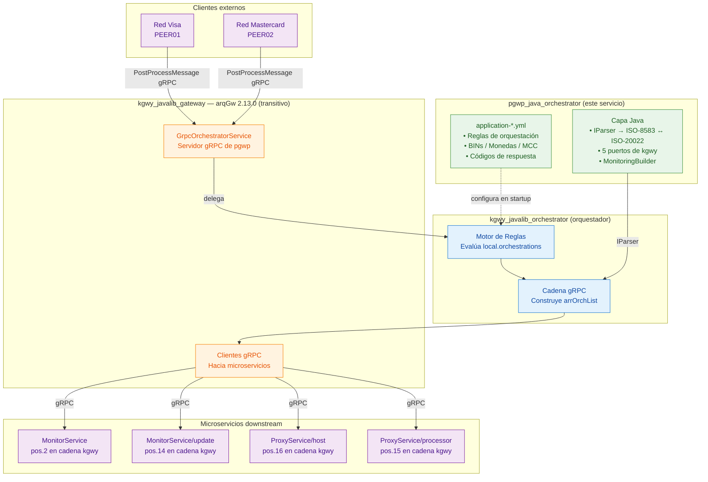
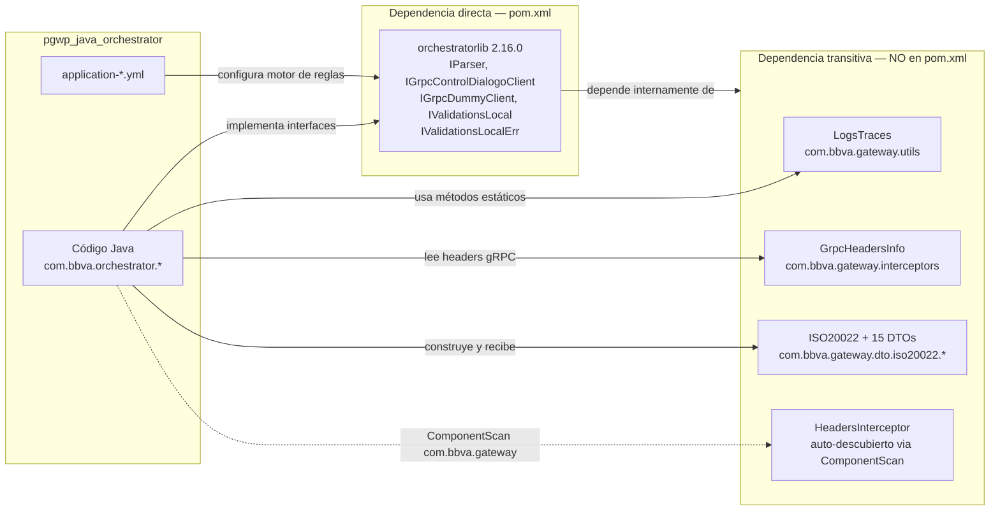
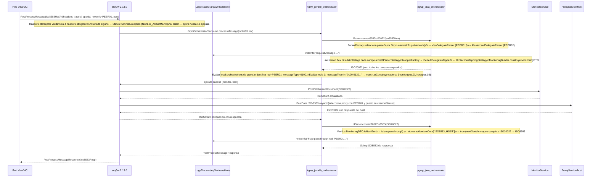
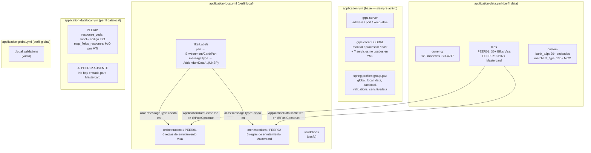
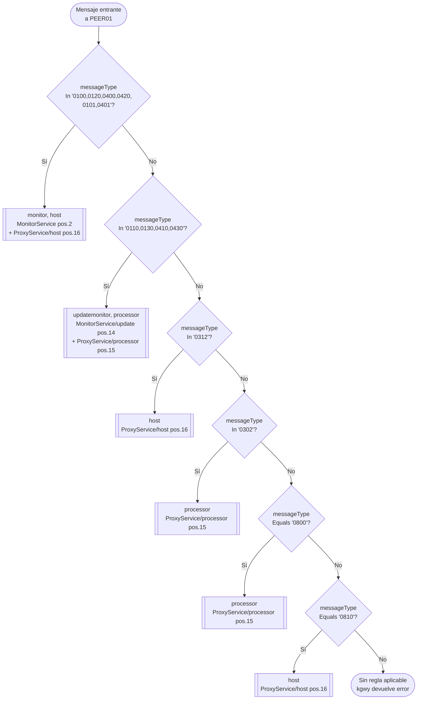
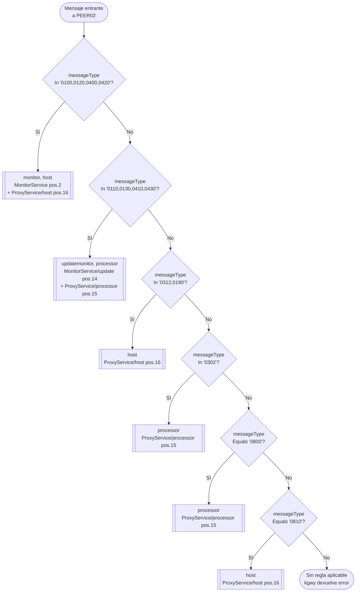
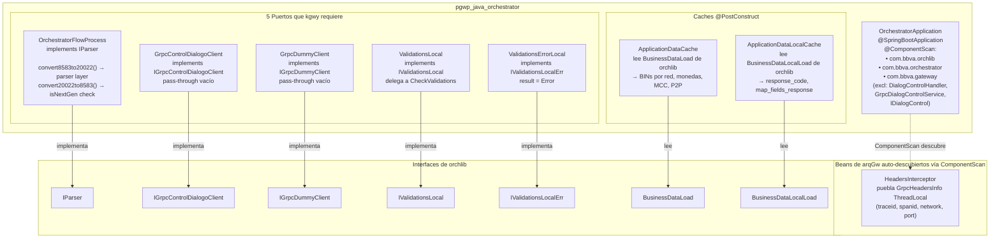
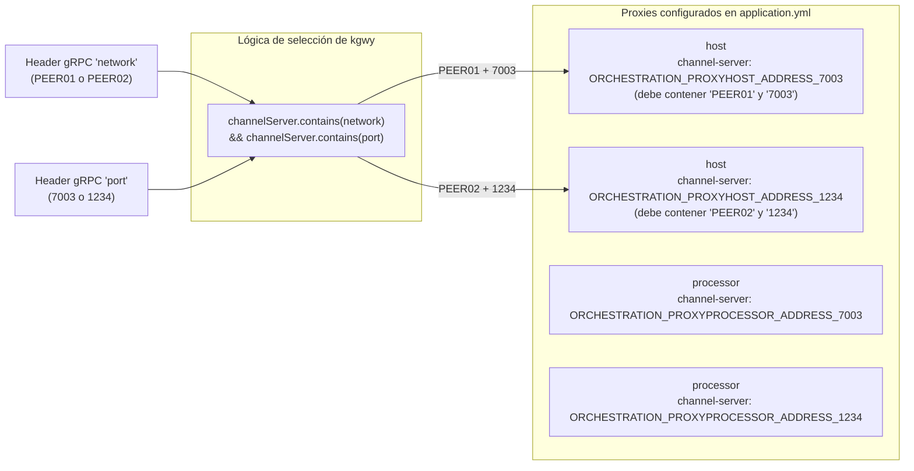
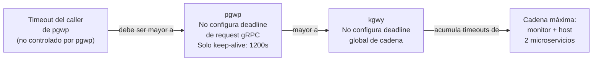

# pgwp_java_orchestrator — Arquitectura

> Documento generado por `prompts/phase3-architecture.md`.
> Fuentes: CLAUDE.md, CONTRACT.md, TRANSITIVE-CONTRACT.md, orchestratorlib-contract.md,
> código fuente de `src/main/` y `docs/configuration-examples/`.

---

## 1. Posición en el ecosistema

### Diagrama de contexto completo



**Leyenda:**
- Verde: artefactos propios de pgwp_java_orchestrator
- Azul: kgwy_javalib_orchestrator — dependencia directa
- Naranja: arqGw — dependencia transitiva visible
- Violeta: sistemas externos / microservicios downstream

### Rol en una línea

pgwp_java_orchestrator convierte mensajes ISO-8583 de las redes Visa (PEER01) y
Mastercard (PEER02) a ISO-20022, define vía YML qué microservicios se invocan
para cada tipo de mensaje, y delega la ejecución de esa cadena a
kgwy_javalib_orchestrator/arqGw.

---

## 2. Dependencias y visibilidad transitiva

### Diagrama de dependencias



### Por qué pgwp usa clases de arqGw directamente

arqGw no es dependencia directa de pgwp — está en el pom.xml de kgwy.
Sin embargo tres superficies de arqGw atraviesan kgwy sin ser abstraídas:

1. **`LogsTraces`** (métodos estáticos): kgwy no ofrece una API de logging propia;
   pgwp llama directamente a la utilidad de trazabilidad de arqGw.

2. **`GrpcHeadersInfo`** (ThreadLocal): `HeadersInterceptor` de arqGw puebla el
   ThreadLocal al inicio de cada request. kgwy no re-expone esos headers — pgwp
   los lee directamente para seleccionar el parser/mapper por red.

3. **`ISO20022` + DTOs**: la interfaz `IParser` de kgwy usa el modelo de datos de
   arqGw como parámetro. Al implementar `IParser`, pgwp está obligado a trabajar
   con `com.bbva.gateway.dto.iso20022.*`.

4. **`HeadersInterceptor`** (vía ComponentScan): pgwp incluye `"com.bbva.gateway"`
   en su `@ComponentScan` para que Spring auto-descubra `HeadersInterceptor` y lo
   haga disponible para que kgwy lo registre en `@GrpcService(interceptors=...)`.

### Tabla de contratos por dependencia

| Dependencia | Tipo | Versión | Contrato en pgwp |
|-------------|------|---------|-----------------|
| kgwy_javalib_orchestrator (orchestratorlib) | Directa en pom.xml | 2.16.0 | `dependencies/kgwy_javalib_orchestrator/CONTRACT.md` |
| kgwy_javalib_gateway (arqGw) | Transitiva — no en pom.xml | 2.13.0 | `dependencies/kgwy_javalib_orchestrator/transitive/arqGw/TRANSITIVE-CONTRACT.md` |

---

## 3. Flujo completo de una solicitud

### Diagrama de secuencia — Flujo de compra (0100 Visa)



### Descripción paso a paso

| Paso | Quién lo ejecuta | Rol del YML de pgwp | Artefacto de pgwp |
|------|-----------------|--------------------|--------------------|
| 1. Recepción del request | arqGw (`HeadersInterceptor`) | — | Ninguno — arqGw valida los 4 headers antes de que pgwp actúe |
| 2. `convert8583to20022` | pgwp (`OrchestratorFlowProcess`) | — | `ParserFactory` selecciona el parser por `GrpcHeadersInfo.getNetwork()` |
| 3. Parseo ISO-8583 | pgwp (VisaDelegateParser / MastercardDelegateParser) | — | Lee bitmap, campos 1-128, subcampos TLV/fijo/variable |
| 4. Mapeo a ISO-20022 | pgwp (`DefaultDelegateMapper` + 10 estrategias) | — | `MonitoringBuilder` usa BINs de `application-data.yml` |
| 5. Evaluación de reglas | kgwy (motor BRMS) | **`local.orchestrations`** de pgwp define qué función aplica | — |
| 6. Construcción de cadena | kgwy | **`local.orchestrations`** define las funciones (`monitor,host`) | — |
| 7. Invocación MonitorService | arqGw (cliente gRPC) | — | — |
| 8. Invocación ProxyService | arqGw (cliente gRPC) | `channelServer` de `host`/`processor` debe contener red y puerto | — |
| 9. `convert20022to8583` | pgwp (`OrchestratorFlowProcess`) | — | Verifica `isNextGen` → passthrough o mapeo completo |
| 10. Respuesta al caller | arqGw | — | — |

---

## 4. Arquitectura del YML de pgwp

### Estructura de los YMLs de pgwp



### PEER01 (Visa) — Diagrama de evaluación de reglas



**Notas sobre PEER01:**
- `0101` y `0401` (mensajes advice de Visa) se procesan como compras normales — incluidos en la regla 1
- La regla 2 cubre compras (`0110`) y reversals (`0410`) de respuesta indistintamente
- `0312` es un pass-through puro a host (sin monitoreo)
- `0800`/`0810` son mensajes de administración de red — `0800` va a processor, `0810` a host (asimétrico)
- El orden importa: `0100` activa la regla 1 y las siguientes no se evalúan (short-circuit)

### PEER02 (Mastercard) — Diagrama de evaluación de reglas



**Notas sobre PEER02 vs PEER01:**
- PEER02 **no incluye** `0101` y `0401` (advice de Visa no aplica a Mastercard)
- PEER02 **añade** `0190` (Reversal Advice Response de Mastercard) junto con `0312`
- Estructura simétrica de las 6 reglas — misma lógica, diferente conjunto de mensajes

---

## 5. Arquitectura Java de pgwp

### Contexto

pgwp tiene dos categorías de código Java:

1. **Capa de conversión de protocolos** (principal — documentada en CLAUDE.md §3.5):
   parser ISO-8583 y mapper ISO-20022 con ~80 clases.

2. **Integración con kgwy/arqGw** (esta sección):
   los 5 puertos requeridos por kgwy y el mecanismo de ComponentScan.

### Diagrama de integración Java con kgwy/arqGw



### Responsabilidades de los 5 puertos

| Puerto (interfaz orchlib) | Implementación pgwp | Responsabilidad |
|---------------------------|---------------------|-----------------|
| `IParser` | `OrchestratorFlowProcess` | Conversión ISO-8583 ↔ ISO-20022. Es el punto de entrada de toda la lógica de negocio de pgwp |
| `IGrpcControlDialogoClient` | `GrpcControlDialogoClient` | Pass-through vacío — pgwp no usa la función `dialog` |
| `IGrpcDummyClient` | `GrpcDummyClient` | Pass-through vacío — pgwp no usa `dummyprocessor` |
| `IValidationsLocal` | `ValidationsLocal` | Delega a `CheckValidations.checkValidationsLocal()` |
| `IValidationsLocalErr` | `ValidationsErrorLocal` | Escribe `"Error"` en `processingResult.resultData.result` |

### OrchestratorApplication — ComponentScan

```java
// OrchestratorApplication.java
@SpringBootApplication
@ComponentScan(
    basePackages = {"com.bbva.orchlib", "com.bbva.orchestrator", "com.bbva.gateway"},
    excludeFilters = @ComponentScan.Filter(
        type = FilterType.ASSIGNABLE_TYPE,
        classes = {DialogControlHandler.class, IDialogControl.class, GrpcDialogControlService.class}
    ))
public class OrchestratorApplication {
    public static void main(String[] args) {
        SpringApplication.run(OrchestratorApplication.class, args);
    }
}
```

- Incluye `"com.bbva.gateway"` para que Spring descubra `HeadersInterceptor`
- Excluye explícitamente el servicio de control de diálogo estándar de arqGw
  (pgwp provee `GrpcControlDialogoClient` como implementación propia de paso)

---

## 6. Arquitectura de configuración

### Cómo Spring Boot carga la configuración de pgwp

```mermaid
graph TD
    subgraph yml ["YMLs de pgwp en src/main/resources/"]
        base["application.yml\n• gRPC server config\n• 12 canales gRPC cliente\n• spring.profiles.group.gw"]
        local["application-local.yml\n• local.filterLabels\n• local.orchestrations (PEER01/PEER02)\n• local.validations (vacío)"]
        global["application-global.yml\n• global.validations (vacío)"]
        data["application-data.yml\n• data.currency (120)\n• data.bins (PEER01/PEER02)\n• data.custom (P2P, MCC)"]
        datalocal["application-datalocal.yml\n• datalocal[PEER01].response_code\n• datalocal[PEER01].map_fields_response\n• ⚠️ PEER02 ausente"]
    end

    subgraph spring ["Spring Boot (startup)"]
        boot["@SpringBootApplication\nCarga application.yml siempre"]
        profileGW["Perfil 'gw' activo\nCarga: global + local + data\n+ datalocal + validations + sensitivedata"]
    end

    subgraph beans ["Beans de kgwy que leen el YML"]
        RulesLocal["RulesLocalLoad\nlee local.orchestrations\ny local.filterLabels"]
        RulesGlobal["RulesGlobalLoad\nlee global.validations"]
        BizData["BusinessDataLoad\nlee data.currency, data.bins,\ndata.custom"]
        BizDataLocal["BusinessDataLocalLoad\nlee datalocal[].response_code\ny datalocal[].map_fields_response"]
    end

    base --> boot
    boot -->|@spring.profiles.active=gw| profileGW
    profileGW --> local & global & data & datalocal
    local --> RulesLocal
    global --> RulesGlobal
    data --> BizData
    datalocal --> BizDataLocal
```

### Diferencias entre perfiles de ambiente

| Aspecto | `application-local.yml` | `application-data.yml` |
|---------|------------------------|------------------------|
| Qué configura | Reglas de orquestación (`orchestrations`) y aliases (`filterLabels`) | Datos de negocio estáticos (BINs, monedas, MCC, P2P) |
| Cargado por perfil | `local` (parte del grupo `gw`) | `data` (parte del grupo `gw`) |
| Cambia entre ambientes | No (mismas reglas en todos los ambientes) | No (mismos datos estáticos en todos los ambientes) |
| Leído por bean de kgwy | `RulesLocalLoad` | `BusinessDataLoad` |

> pgwp solo tiene un `application-local.yml` — las mismas reglas de orquestación
> se usan en todos los ambientes (local, data, producción). La diferenciación por
> ambiente está en la infraestructura (variables de entorno) no en las reglas.

### Configuración de canales gRPC y selección de proxy



### Timeout — situación actual



> ⚠️ PENDIENTE DE VALIDACIÓN: pgwp no configura deadline gRPC para
> `PostProcessMessage`. La conexión puede mantenerse hasta 1200s si un
> microservicio no responde. Evaluar si agregar un deadline explícito
> (ej. 30s) para la cadena más larga (monitor + host).

---

## 7. Manejo de errores

### Origen de los errores en pgwp

```mermaid
graph TD
    subgraph externo ["Errores antes de que pgwp se ejecute"]
        headerErr["Header gRPC faltante\n(traceid/spanid/network/port)"]
        headerExc["StatusRuntimeException\nINVALID_ARGUMENT\narqGw lo lanza al caller"]
        headerErr --> headerExc
    end

    subgraph parseo ["Errores en convert8583to20022 - código de pgwp"]
        parseErr["Campo ISO-8583 inválido"]
        logicErr["Lógica de campo de red inválida"]
        mandatory["Campo obligatorio faltante"]
        parseExc["ParserFieldsException\nPGWP-00140"]
        logicExc["LogicFieldsException"]
        mandatoryExc["MandatoryFieldsException"]
        parseErr --> parseExc
        logicErr --> logicExc
        mandatory --> mandatoryExc
    end

    subgraph mapper ["Errores en DefaultDelegateMapper - código de pgwp"]
        mapErr["Error en estrategia de mapeo\nISO-20022"]
        mapExc["MapperFieldsException\nPGWP-00121 y otros"]
        fallback["Fallback silencioso:\nISO20022 mínimo con\ncardId y transactionRef vacíos"]
        mapErr --> mapExc
        mapExc -->|"catch MapperFieldsException\n+ LogsTraces.writeWarning"| fallback
    end

    subgraph cadena ["Errores en la cadena de microservicios - kgwy los maneja"]
        msErr["Error de MonitorService\no ProxyService"]
        kgwyAbsorb["kgwy serializa error\nen traceData del ISO20022"]
        pgwpRecibe["pgwp siempre recibe ISO20022\nnunca una excepción de la cadena"]
        msErr --> kgwyAbsorb --> pgwpRecibe
    end

    subgraph monitoring ["Errores en MonitoringBuilder - código de pgwp"]
        monErr["RuntimeException al construir\ndatos de monitoreo"]
        monFallback["Fallback: retorna monitoring\ncomo está (posiblemente incompleto)"]
        monErr -->|"catch RuntimeException\n+ LogsTraces.writeError"| monFallback
    end
```



### Tabla de manejo de errores

| Error | Quién lo lanza | Quién lo captura | Acción | Documentado en |
|-------|---------------|-----------------|--------|----------------|
| Header gRPC faltante | `HeadersInterceptor` (arqGw) | El caller de pgwp — pgwp no llega a ejecutarse | `StatusRuntimeException(INVALID_ARGUMENT)` al caller | TRANSITIVE-CONTRACT.md §5 |
| `MapperFieldsException` | Estrategias de mapeo de pgwp | `DefaultDelegateMapper` | `LogsTraces.writeWarning` + ISO20022 mínimo de fallback | CLAUDE.md §3.5 |
| `Exception` genérica en mapper | Mapper de pgwp | `DefaultDelegateMapper` | `LogsTraces.writeWarning("PGWP-00121...")` + fallback | CLAUDE.md §3.5 |
| `RuntimeException` en monitoring | `MonitoringBuilder` | `MonitoringBuilder` | `LogsTraces.writeError` + monitoring parcial | CLAUDE.md §3.5 |
| Error de microservicio en cadena | MonitorService / ProxyService | kgwy | Serializa en `traceData` del ISO20022 | CONTRACT.md §5 |
| `InternalServerException` (arqGw) | arqGw | kgwy | Absorbe → escribe en `traceData` | orchestratorlib-contract.md §6 |

### Comportamiento ante fallo parcial de la cadena

Si MonitorService falla durante la invocación `monitor,host`:

1. arqGw captura la excepción del cliente gRPC de MonitorService
2. kgwy la serializa como `gw_error_callMonitor` en `traceData` del ISO20022
3. kgwy continúa la cadena (invoca ProxyService/host)
4. kgwy llama a pgwp con `convert20022to8583(ISO20022)`
5. pgwp **recibe el ISO20022 con error en traceData** — no una excepción
6. El ISO8583 de respuesta puede construirse aunque el monitor haya fallado

> El comportamiento exacto de continuación/interrupción de la cadena ante fallos
> parciales está documentado en `orchestratorlib-contract.md §6`.

---

## 8. Decisiones de arquitectura (ADRs)

### ADR-001: Integración declarativa de orquestación vía YML

- **Contexto**: pgwp necesita orquestar microservicios con comportamiento diferente
  por red (Visa/Mastercard) y por tipo de mensaje ISO-8583
- **Decisión**: toda la lógica de routing se define en `application-local.yml`;
  no hay código Java de orquestación en pgwp
- **Consecuencias positivas**:
  - Cambios de comportamiento de routing sin redespliegue de código Java
  - Reglas auditables directamente en el YML del repositorio
  - Sin riesgo de bugs en lógica de orquestación propia
  - Nuevos tipos de mensaje solo requieren agregar una regla en el YML
- **Consecuencias negativas**:
  - El comportamiento de pgwp depende de la versión de kgwy instalada
  - Errores en el YML (alias no definido, función no existente) solo detectables en runtime
  - Depuración requiere entender el motor de reglas de kgwy
- **Estado**: Activo

### ADR-002: Uso directo de clases de arqGw vía ComponentScan

- **Contexto**: kgwy no abstrae completamente `LogsTraces`, `GrpcHeadersInfo` y el
  modelo ISO-20022 de arqGw. pgwp necesita acceder a esos elementos
- **Decisión**: pgwp incluye `"com.bbva.gateway"` en `@ComponentScan` y usa
  directamente las clases de arqGw, a pesar de no tenerlo como dependencia
  explícita en su `pom.xml`
- **Consecuencias**:
  - Acoplamiento transitivo medio-alto con la versión de arqGw que usa kgwy
  - Si kgwy actualiza arqGw, pgwp puede ver errores de compilación o runtime
  - Documentado en `TRANSITIVE-CONTRACT.md` para control del riesgo
  - pgwp llama a `GrpcHeadersInfo.getNetwork()` sin null-check porque arqGw
    garantiza su presencia (HeadersInterceptor rechaza requests sin header)
- **Estado**: Activo — riesgo conocido y documentado en TRANSITIVE-CONTRACT.md

### ADR-003: Capa de conversión ISO-8583 ↔ ISO-20022 propia de pgwp

- **Contexto**: pgwp necesita transformar el mensaje ISO-8583 de la red entrante
  a ISO-20022 (modelo de kgwy/arqGw) y viceversa en la respuesta
- **Decisión**: pgwp implementa su propia capa de parsing/mapeo con patrón
  Strategy y Factory: parser por red (Visa/Mastercard) y mapper con 10 estrategias
  por sección del modelo ISO-20022
- **Consecuencias positivas**:
  - Parsing a nivel de bitmap — control completo sobre campos y subcampos
  - Estrategias independientes por sección — fácil agregar o modificar una sección
  - Factories intercambiables por red — extensible a una tercera red
- **Consecuencias negativas**:
  - Acoplamiento con la estructura de `ISO20022` + ~15 DTOs de arqGw
  - Cambios en el modelo de arqGw requieren actualizar múltiples estrategias
  - La capa de conversión es la principal fuente de complejidad de pgwp
- **Estado**: Activo — documentado en CLAUDE.md §3.5

### ADR-004: Fallback silencioso en el mapper

- **Contexto**: los errores de mapeo ISO-20022 (`MapperFieldsException`) en
  `DefaultDelegateMapper` no propagan la excepción
- **Decisión**: al capturar `MapperFieldsException` o `Exception`, el mapper
  devuelve un ISO20022 mínimo (con cardId y transactionReference vacíos) en lugar
  de propagar el error
- **Consecuencias positivas**:
  - La transacción no falla abruptamente por un error de mapeo de un campo opcional
- **Consecuencias negativas**:
  - El ISO20022 de fallback puede tener datos incompletos que causen fallos
    más adelante en la cadena (en MonitorService o ProxyService)
  - El error queda solo en `LogsTraces.writeWarning` — no en la respuesta al caller
  - Dificulta el debugging: la causa raíz puede perderse si los logs no se monitorean
- **Estado**: Activo — marcado como deuda técnica en CLAUDE.md §9

---

## 9. Guía de evolución de pgwp

### Cambios que NO requieren modificar código Java

Solo requieren actualizar el YML y redesplegar:

| Cambio | Archivo | Impacto en runtime |
|--------|---------|-------------------|
| Agregar nuevo tipo de mensaje a una red existente | `application-local.yml` | kgwy lo evalúa automáticamente al inicio |
| Agregar nueva red en `orchestrations` | `application-local.yml` | kgwy registra la nueva red |
| Cambiar función asociada a un tipo de mensaje | `application-local.yml` | kgwy ajusta la cadena de microservicios |
| Reordenar las reglas (cambiar prioridad) | `application-local.yml` | short-circuit evalúa en el nuevo orden |
| Agregar nuevo alias en `filterLabels` | `application-local.yml` | disponible en condiciones de reglas |
| Agregar nuevos BINs, monedas, o códigos MCC | `application-data.yml` | `ApplicationDataCache` los lee en @PostConstruct |
| Agregar códigos de respuesta o campos por MTI | `application-datalocal.yml` | `ApplicationDataLocalCache` los lee en @PostConstruct |

### Cambios que SÍ requieren modificar código Java

| Cambio | Causa | Archivos afectados |
|--------|-------|--------------------|
| Soporte de nueva red (ej. PEER03) | Necesita parser y mapper propios | `ParserFactory`, `MapperFactory`, nuevas implementaciones de `ISO8583DelegateParser` e `ISO20022DelegateMapper` |
| Parseo de nuevo campo ISO-8583 | Nueva definición de campo y lógica | `VisaISOField`/`MastercardISOField`, nueva `FieldParserStrategy` o extensión de existente |
| Nueva sección del modelo ISO-20022 | Nueva estrategia de mapeo | Nueva clase `SectionMappingStrategy`, registro en `DefaultDelegateMapper` |
| Cambio en API de `LogsTraces` (arqGw) | Cambio en arqGw vía kgwy | 11 archivos que usan `LogsTraces.writeInfo/Warning/Error` |
| Cambio en API de `GrpcHeadersInfo` (arqGw) | Cambio en arqGw vía kgwy | 6 archivos que llaman `getNetwork()`, `getPort()`, `getTraceId()` |
| Cambio en estructura de `ISO20022` o sus DTOs (arqGw) | Cambio en arqGw vía kgwy | Toda la capa de mapeo (~10 estrategias + DefaultDelegateMapper) |
| Nueva función de kgwy que pgwp deba implementar | Nueva versión de orchestratorlib | Nueva clase que implementa la interfaz de orchlib + registro en Spring |

### Cambios en dependencias que impactan a pgwp

| Cambio | En quién | Acción requerida en pgwp |
|--------|----------|--------------------------|
| Nueva versión de kgwy (orchestratorlib) | kgwy | Revisar `orchestratorlib-contract.md` por breaking changes en YML y puertos |
| Nueva versión de arqGw (vía kgwy) | arqGw → kgwy | Revisar `TRANSITIVE-CONTRACT.md` Secciones 2, 3 y 4 |
| Cambio en estructura YML de kgwy | kgwy | Actualizar `application-*.yml` de pgwp |
| Nueva función disponible en kgwy | kgwy | Opcional — pgwp puede usarla en el YML; puede requerir implementar nuevo puerto |
| Función eliminada de kgwy | kgwy | **CRÍTICO** — revisar todas las reglas YML de pgwp; puede causar error en startup |
| Nuevo campo obligatorio en ISO20022.builder() | arqGw → kgwy | `DefaultDelegateMapper` + fallbacks deben poblar el nuevo campo |

### Proceso de actualización de versión de kgwy

```
1. Leer orchestratorlib-contract.md de la nueva versión
   → identificar breaking changes en estructura YML y puertos
2. Actualizar application-*.yml si la estructura de orchestrations cambió
3. Leer TRANSITIVE-CONTRACT.md actualizado
   → verificar cambios en LogsTraces, GrpcHeadersInfo, ISO20022 DTOs
4. Actualizar código Java de pgwp si hay cambios en la API transitiva
5. Actualizar dependencies/kgwy_javalib_orchestrator/CONTRACT.md
6. Ejecutar:
   execute prompts/updates/update-kgwy-version.md
```

---

## ⚠️ Pendientes de validación en esta arquitectura

1. **Condición de activación de `isNextGen`**: `OrchestratorFlowProcess.convert20022to8583()`
   ejecuta el flujo de mapeo completo cuando `MonitoringDTO.isNextGen = true`.
   No está documentado qué microservicio de la cadena pone este flag.
   Hasta que se valide, el flujo nextGen es ⚠️ PENDIENTE DE VALIDACIÓN.

2. **PEER02 ausente en `application-datalocal.yml`**: Mastercard no tiene entrada
   en el YML de códigos de respuesta. `ApplicationDataLocalCache` devuelve
   `"NO_FOUND_"+responseCode` para cualquier código Mastercard.
   Confirmar si es intencional.

3. **Microservicios configurados sin uso en reglas YML**: `fraud`, `crypto`,
   `apiconnector`, `events`, `dummyprocessor`, `flowhandler`, `dialogcontrol`
   tienen canales gRPC configurados en `application.yml` pero ninguna regla
   los invoca. Sus variables de entorno son obligatorias en todos los ambientes.
   ¿Pueden eliminarse las conexiones no usadas?

4. **Deadline gRPC sin configurar**: pgwp no establece un deadline de request
   para `PostProcessMessage`. La cadena más larga invoca 2 microservicios.
   Evaluar si es necesario un deadline explícito.
